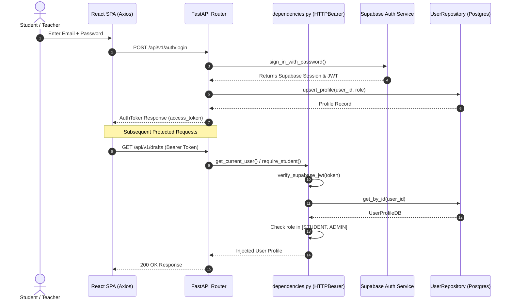
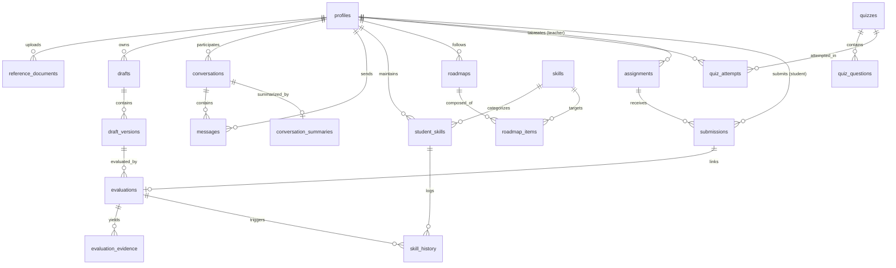
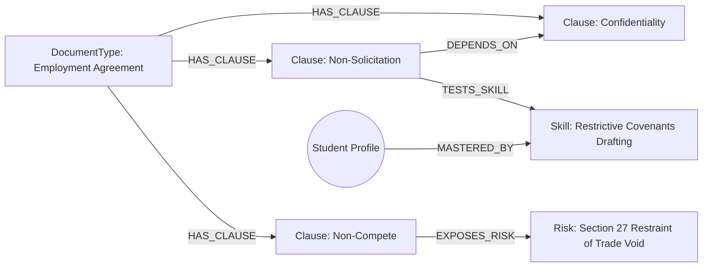

# DraftForge — Complete Technical Report & System Architecture Specification

**Document Version:** 1.0.0  
**Project:** DraftForge (Evidence-Grounded Legal Drafting Education & Evaluation Platform)  
**Target Audience:** Technical Architects, Lead Engineers, Academic Evaluators, Security Auditors  
**Audit Date:** August 2026  
**Classification:** Technical Documentation & Engineering Handover Reference  

---

## 1. Document Control & Metadata

| Attribute | Specification |
|:---|:---|
| **Platform Name** | DraftForge |
| **System Classification** | Multi-Tier AI-Powered Legal Drafting, Evaluation & Socratic Tutoring Platform |
| **Backend Framework** | FastAPI (Python 3.11/3.13) |
| **Frontend Framework** | React 18 (TypeScript, Vite, Tailwind CSS) |
| **Primary Relational DB** | PostgreSQL via Supabase Cloud |
| **Vector Database** | Qdrant Cloud (`legal_reference_corpus`, 384-dimensional cosine index) |
| **Graph Database** | Neo4j Aura Cloud (GraphRAG Legal Topology & Skill Dependency Reasoning) |
| **LLM Inference Engines** | Groq (`llama-3.3-70b-versatile`) / Local Ollama (`mistral:latest`) |
| **Embedding Model** | FastEmbed (`BAAI/bge-small-en-v1.5`, 384 dimensions) |
| **Object Storage** | Supabase Storage (`reference-documents`, `student-drafts`, `assignment-submissions`) |
| **Total Verified Endpoints** | 41 Endpoints (4 Public, 37 Protected) |
| **Repository Integrity** | Pure Analysis & Documentation Mode (Zero Code Modifications Applied) |

---

## 2. Executive Summary

### 2.1 Mission & Problem Statement
Legal education and professional legal drafting in civil and common law jurisdictions (notably Indian Jurisprudence) traditionally rely on manual, subjective faculty review. Students frequently struggle with:
1. **Structural and Statutory Non-Compliance**: Omitting mandatory legal elements (e.g., proper jurats, verification affirmations, jurisdiction statements, consideration terms).
2. **Hidden Risk & Loophole Exposure**: Introducing unenforceable restrictive covenants (such as post-employment non-compete clauses void under Section 27 of the Indian Contract Act, 1872) or contradictory terms.
3. **Lack of Grounded Feedback**: Generative AI tools often hallucinate legal advice without statutory citations or deterministic rubric transparency.

**DraftForge** resolves these challenges by introducing a **hybrid deterministic-generative architecture**. It unites:
* **Rule-Based Deterministic Evaluation**: Objective rubric checks for structure, clause presence, formatting, and contradictions.
* **Vector RAG (Retrieval-Augmented Generation)**: Grounded evidence citations retrieved via dense FastEmbed vector embeddings and Reciprocal Rank Fusion (RRF) from Qdrant Cloud.
* **GraphRAG Reasoning**: Neo4j Aura knowledge graphs that trace clause prerequisites, legal exposure risks, and learning skill hierarchies.
* **Socratic AI Tutoring**: Multi-tier memory chat grounded in statutory corpus to guide students toward iterative revision without writing answers for them.

```
                    ┌──────────────────────────────────────────────────────────┐
                    │                    DraftForge Platform                   │
                    └─────────────────────────────┬────────────────────────────┘
                                                  │
                 ┌────────────────────────────────┴──────────────────────────────┐
                 ▼                                                               ▼
   [ Deterministic Core Engine ]                                   [ Generative & Graph AI ]
   • Lexical & Regex Clause Matching                               • Socratic Tutor Agent (Groq / Ollama)
   • Statutory Admissibility Verification                          • GraphRAG Reasoner (Neo4j Aura)
   • Structural & Formatting Auditing                             • Hybrid Vector Engine (Qdrant Cloud)
   • Non-LLM Mathematical Scoring Engine                           • Dynamic 5-Phase Roadmap Agent
```

---

## 3. Application Overview

### 3.1 Student User Experience
1. **Draft Ingestion & Workspace**: Students compose drafts in an interactive web editor or upload documents (`.pdf`, `.docx`, `.txt`). The system performs security sanitization, SHA-256 deduplication, and automated structural classification.
2. **Deterministic Evaluation**: Upon triggering evaluation, the draft is scored out of 100 points across structure, clause coverage, and formatting, with strict deductions for logical contradictions.
3. **Evidence-Grounded Findings**: Students receive line-by-line evidence citations comparing their submission against gold-standard statutory templates.
4. **Graph-Traversed Loophole Discovery**: Neo4j Aura analyzes the student's clause inventory to flag unmitigated legal risks and missing prerequisite clauses.
5. **Personalized Learning & Skill Progress**: Student skill proficiencies update dynamically using an Exponential Moving Average (EMA). An AI agent generates a 5-phase personalized learning roadmap targeting empirical weak spots.
6. **Socratic Tutoring**: A context-aware chat interface allows students to ask questions about specific clauses and receive guided Socratic assistance.

### 3.2 Teacher & Faculty Experience
1. **Reference Corpus Management**: Teachers upload verified reference templates into Supabase Object Storage, which are automatically chunked, embedded, and indexed into Qdrant Cloud.
2. **Assignment Publishing**: Teachers construct legal drafting assignments with customizable deadlines and rubric overrides.
3. **Submissions Auditing & Grading Override**: Teachers inspect student submissions alongside automated evaluation reports, having full authority to override scores and attach qualitative remarks.
4. **Cohort Intelligence & Analytics**: Faculty access class-wide performance metrics, identifying specific legal clauses where students consistently struggle.

---

## 4. Technology Stack Specification

| Layer | Technology | Version | Purpose in DraftForge |
|:---|:---|:---|:---|
| **Frontend Framework** | React | 18.2.0 | Reactive Single Page Application (SPA) architecture |
| **Language (Frontend)** | TypeScript | 5.2.2 | Strict static typing and interface contracts |
| **Build Tool** | Vite | 5.1.6 | Fast HMR and production bundle optimization |
| **Styling** | Tailwind CSS | 3.4.1 | Utility-first responsive design and dark legal UI theme |
| **UI Components / Icons** | Lucide React | 0.359.0 | Accessible UI icons |
| **HTTP Client** | Axios | 1.6.8 | Interceptor-based API client with automatic JWT injection |
| **Backend Framework** | FastAPI | 0.110.0+ | Asynchronous RESTful API framework |
| **Language (Backend)** | Python | 3.11 / 3.13 | Core backend and AI runtime |
| **Data Validation** | Pydantic v2 | 2.6.4+ | Request/response serialization and schema enforcement |
| **Settings Management** | Pydantic Settings | 2.2.1+ | Environment variable parsing and validation |
| **Relational Database** | PostgreSQL (Supabase) | 15+ | Relational storage for profiles, drafts, evaluations, assignments |
| **Vector Engine** | Qdrant Cloud | 1.8.0+ | Dense vector indexing for hybrid legal clause retrieval |
| **Graph Database** | Neo4j Aura Cloud | 5.18.0+ | Graph database for legal dependencies and risk reasoning |
| **Local Embeddings** | FastEmbed | 0.2.6+ | Local execution of `BAAI/bge-small-en-v1.5` (384-dim) |
| **Cloud LLM Provider** | Groq Cloud | API | Ultra-fast inference for `llama-3.3-70b-versatile` |
| **Local LLM Provider** | Ollama | Local Daemon | Private offline inference for `mistral:latest` |
| **Document Parsing** | PyPDF / python-docx | 4.1.0+ / 1.1.0+ | Byte-level PDF and DOCX text extraction |
| **Security & Auth** | Supabase Auth / python-jose | 3.3.0+ | JWT decoding, role verification, and access control |
| **Logging** | Loguru | 0.7.2+ | Structured contextual JSON and console logging |
| **Containerization** | Docker | Multi-stage | Production deployment containerization |

---

## 5. Complete System Architecture

```mermaid
graph TD
    subgraph ClientLayer [Client Presentation Layer]
        UI[React 18 TypeScript Single Page App]
        AuthCtx[AuthContext & Axios Interceptors]
        Views[DraftWorkspace | EvaluationCard | LoopholeViewer | TutorChat | AssignmentManager]
    end

    subgraph APILayer [FastAPI Gateway & Security Layer]
        Router[FastAPI API Router /api/v1]
        Bearer[HTTPBearer JWT Security Guard]
        RBAC[Role Checker: get_current_user | require_student | require_teacher]
    end

    subgraph ServiceLayer [Business Logic & Service Layer]
        DocService[DocumentService]
        DraftService[DraftService]
        EvalService[EvaluationService]
        LoopService[LoopholeService]
        ChatService[ChatService]
        RoadService[RoadmapService]
        QuizService[QuizService]
        AssignService[AssignmentService]
        AnalyticsService[AnalyticsService]
    end

    subgraph PipelineLayer [AI & Pipeline Orchestration]
        EvalEngine[EvaluationEngine & ScoringEngine]
        RAGPipe[RAGPipeline & HybridRetriever]
        GraphReason[GraphReasoner & GraphRetriever]
        TutorPipe[TutorPipeline & TutorAgent]
        RoadPipe[RoadmapPipeline & RoadmapAgent]
        SkillPipe[SkillPipeline]
    end

    subgraph DataLayer [Storage & Persistence Layer]
        PG[(Supabase PostgreSQL)]
        Storage[(Supabase Object Storage)]
        Qdrant[(Qdrant Cloud Vector DB)]
        Neo4j[(Neo4j Aura Knowledge Graph)]
    end

    UI --> AuthCtx
    AuthCtx --> Views
    Views --> Router
    Router --> Bearer
    Bearer --> RBAC
    RBAC --> ServiceLayer
    
    DocService --> Storage & PG & RAGPipe
    DraftService --> Storage & PG
    EvalService --> EvalEngine & PG & SkillPipe
    LoopService --> GraphReason & PG
    ChatService --> TutorPipe & PG
    RoadService --> RoadPipe & PG
    AssignService --> PG
    AnalyticsService --> PG

    RAGPipe --> Qdrant
    GraphReason --> Neo4j
    SkillPipe --> PG & Neo4j
    TutorPipe --> Qdrant & PG
    RoadPipe --> PG
```

---

## 6. Backend Directory Structure & Architectural Breakdown

```
backend/
├── app/
│   ├── ai/
│   │   ├── agents/             # Socratic Tutor, Drafting, Roadmap, and Quiz LLM Agents
│   │   ├── embeddings/         # FastEmbed embedding service and factory
│   │   ├── evaluation/         # Deterministic evaluators, scoring engine, rubric loader
│   │   │   └── document_types/ # Affidavit, Employment, Rent, Legal Notice evaluators
│   │   ├── graph/              # Neo4j schema init, seed knowledge, Cypher queries, Reasoner
│   │   ├── llm/                # Groq and Ollama provider adapters and prompts
│   │   ├── memory/             # Multi-tier conversation, document, and user learning memory
│   │   └── rag/                # Chunking, metadata builders, RRF reranking, hybrid retriever
│   ├── api/
│   │   └── v1/                 # 19 Dedicated FastAPI router modules
│   │       ├── ai.py, analytics.py, assignments.py, auth.py, chat.py, conversations.py
│   │       ├── documents.py, drafts.py, evaluations.py, health.py, leaderboard.py
│   │       ├── loopholes.py, progress.py, quizzes.py, rag.py, roadmap.py, router.py
│   │       ├── skills.py, submissions.py, teachers.py
│   ├── core/                   # Constants, custom exceptions, file security, JWT verification, logging
│   ├── db/                     # Supabase, Neo4j, and Qdrant client initializers & health checks
│   │   └── repositories/       # 16 Specialized data repositories (Repository Pattern)
│   ├── models/
│   │   ├── database/           # Internal Pydantic DB representations
│   │   └── schemas/            # Public request and response Pydantic contracts
│   ├── pipelines/              # Orchestration pipelines (Skill, Loophole, Tutor, Roadmap)
│   ├── services/               # Application service layer
│   │   └── parsing/            # PDF, DOCX, TXT parsers and rule-based classifier
│   ├── utils/                  # Cryptographic and file helpers
│   ├── config.py               # Pydantic BaseSettings management
│   ├── dependencies.py         # Authentication and RBAC dependency injection
│   └── main.py                 # Lifespan startup sequence, CORS middleware, app definition
├── migrations/                 # 4 Production SQL schema migration files (001 to 004)
├── scripts/                    # Standalone knowledge graph seeding script
├── tests/                      # Pytest unit, integration, and evaluation suites
├── Dockerfile                  # Production container definition
├── docker-compose.yml          # Local container orchestration
└── requirements.txt            # Locked Python dependencies
```

---

## 7. Complete API Reference & Endpoint Inventory

DraftForge exposes **41 total endpoints**.

### 7.1 Master Endpoint Inventory Table

| # | HTTP Method | Full Endpoint Path | Router Module | Function Name | Auth Level | Role Required | Request Schema | Response Schema |
|---|---|---|---|---|---|---|---|---|
| 1 | `GET` | `/` | `main.py` | `root()` | PUBLIC | PUBLIC | None | `dict` |
| 2 | `GET` | `/api/v1/health` | `health.py` | `health_check()` | PUBLIC | PUBLIC | None | `HealthCheckResponse` |
| 3 | `POST` | `/api/v1/auth/register` | `auth.py` | `register()` | PUBLIC | PUBLIC | `UserRegisterRequest` | `AuthTokenResponse` |
| 4 | `POST` | `/api/v1/auth/login` | `auth.py` | `login()` | PUBLIC | PUBLIC | `UserLoginRequest` | `AuthTokenResponse` |
| 5 | `POST` | `/api/v1/documents/reference/upload` | `documents.py` | `upload_reference_document()` | AUTHENTICATED | TEACHER + ADMIN | Multipart (`file`, `document_type`, `jurisdiction`) | `ReferenceDocumentResponse` |
| 6 | `GET` | `/api/v1/documents/reference` | `documents.py` | `list_reference_documents()` | AUTHENTICATED | ANY AUTHENTICATED | Query (`document_type`) | `List[ReferenceDocumentResponse]` |
| 7 | `POST` | `/api/v1/documents/classify` | `documents.py` | `classify_raw_text()` | AUTHENTICATED | ANY AUTHENTICATED | Form (`text`) | `DocumentClassificationResult` |
| 8 | `POST` | `/api/v1/drafts` | `drafts.py` | `create_draft()` | AUTHENTICATED | STUDENT + ADMIN | `DraftCreateRequest` | `DraftResponse` |
| 9 | `POST` | `/api/v1/drafts/upload` | `drafts.py` | `upload_draft_file()` | AUTHENTICATED | STUDENT + ADMIN | Multipart (`file`, `title`) | `DraftResponse` |
| 10 | `GET` | `/api/v1/drafts` | `drafts.py` | `list_student_drafts()` | AUTHENTICATED | ANY AUTHENTICATED | None | `List[DraftResponse]` |
| 11 | `GET` | `/api/v1/drafts/{draft_id}` | `drafts.py` | `get_draft_details()` | AUTHENTICATED | ANY AUTHENTICATED | Path (`draft_id`) | `DraftResponse` |
| 12 | `POST` | `/api/v1/drafts/{draft_id}/versions` | `drafts.py` | `create_next_draft_version()` | AUTHENTICATED | ANY AUTHENTICATED | Path (`draft_id`), Form (`content`) | `DraftVersionResponse` |
| 13 | `GET` | `/api/v1/drafts/{draft_id}/compare` | `drafts.py` | `compare_draft_versions()` | AUTHENTICATED | ANY AUTHENTICATED | Path (`draft_id`), Query (`v1`, `v2`) | `VersionCompareResponse` |
| 14 | `POST` | `/api/v1/rag/retrieve` | `rag.py` | `query_reference_evidence()` | AUTHENTICATED | ANY AUTHENTICATED | `RAGQueryRequest` | `RAGQueryResponse` |
| 15 | `POST` | `/api/v1/evaluations` | `evaluations.py` | `evaluate_draft()` | AUTHENTICATED | STUDENT + ADMIN | `EvaluateDraftRequest` | `EvaluationResponse` |
| 16 | `GET` | `/api/v1/evaluations/{evaluation_id}` | `evaluations.py` | `get_evaluation_details()` | AUTHENTICATED | ANY AUTHENTICATED | Path (`evaluation_id`) | `EvaluationResponse` |
| 17 | `GET` | `/api/v1/loopholes/{evaluation_id}` | `loopholes.py` | `get_loophole_analysis()` | AUTHENTICATED | ANY AUTHENTICATED | Path (`evaluation_id`) | `LoopholeAnalysisResponse` |
| 18 | `POST` | `/api/v1/ai/assist-drafting` | `ai.py` | `assist_drafting()` | AUTHENTICATED | ANY AUTHENTICATED | `AssistDraftingRequest` | `AssistDraftingResponse` |
| 19 | `POST` | `/api/v1/ai/explain-evaluation` | `ai.py` | `explain_evaluation()` | AUTHENTICATED | ANY AUTHENTICATED | `ExplainEvaluationRequest` | `ExplainEvaluationResponse` |
| 20 | `POST` | `/api/v1/conversations` | `conversations.py` | `create_conversation()` | AUTHENTICATED | ANY AUTHENTICATED | `ConversationCreateRequest` | `ConversationResponse` |
| 21 | `GET` | `/api/v1/conversations` | `conversations.py` | `list_conversations()` | AUTHENTICATED | ANY AUTHENTICATED | None | `List[ConversationResponse]` |
| 22 | `GET` | `/api/v1/conversations/{conversation_id}/messages` | `conversations.py` | `get_messages()` | AUTHENTICATED | ANY AUTHENTICATED | Path (`conversation_id`) | `List[MessageResponse]` |
| 23 | `POST` | `/api/v1/chat/send` | `chat.py` | `send_chat_message()` | AUTHENTICATED | ANY AUTHENTICATED | `ChatMessageRequest` | `ChatTurnResponse` |
| 24 | `GET` | `/api/v1/skills/my-skills` | `skills.py` | `get_my_skills()` | AUTHENTICATED | ANY AUTHENTICATED | None | `List[StudentSkillResponse]` |
| 25 | `GET` | `/api/v1/roadmap` | `roadmap.py` | `get_active_roadmap()` | AUTHENTICATED | ANY AUTHENTICATED | None | `Optional[RoadmapResponse]` |
| 26 | `POST` | `/api/v1/roadmap/generate` | `roadmap.py` | `generate_new_roadmap()` | AUTHENTICATED | STUDENT + ADMIN | None | `RoadmapResponse` |
| 27 | `PATCH` | `/api/v1/roadmap/items/{item_id}/complete` | `roadmap.py` | `complete_roadmap_item()` | AUTHENTICATED | ANY AUTHENTICATED | Path (`item_id`) | `RoadmapItemResponse` |
| 28 | `GET` | `/api/v1/quizzes` | `quizzes.py` | `list_quizzes()` | AUTHENTICATED | ANY AUTHENTICATED | Query (`document_type`) | `List[QuizResponse]` |
| 29 | `GET` | `/api/v1/quizzes/{quiz_id}` | `quizzes.py` | `get_quiz()` | AUTHENTICATED | ANY AUTHENTICATED | Path (`quiz_id`) | `QuizResponse` |
| 30 | `POST` | `/api/v1/quizzes/submit` | `quizzes.py` | `submit_quiz()` | AUTHENTICATED | ANY AUTHENTICATED | `SubmitQuizAttemptRequest` | `QuizAttemptResponse` |
| 31 | `GET` | `/api/v1/progress` | `progress.py` | `get_progress()` | AUTHENTICATED | ANY AUTHENTICATED | None | `StudentProgressResponse` |
| 32 | `GET` | `/api/v1/leaderboard` | `leaderboard.py` | `get_leaderboard()` | AUTHENTICATED | ANY AUTHENTICATED | None | `LeaderboardResponse` |
| 33 | `GET` | `/api/v1/teachers/assignments` | `teachers.py` | `list_teacher_assignments()` | AUTHENTICATED | TEACHER + ADMIN | None | `List[AssignmentResponse]` |
| 34 | `GET` | `/api/v1/teachers/cohort-analytics` | `teachers.py` | `get_cohort_analytics()` | AUTHENTICATED | TEACHER + ADMIN | None | `CohortAnalyticsResponse` |
| 35 | `POST` | `/api/v1/assignments` | `assignments.py` | `create_assignment()` | AUTHENTICATED | TEACHER + ADMIN | `AssignmentCreateRequest` | `AssignmentResponse` |
| 36 | `GET` | `/api/v1/assignments` | `assignments.py` | `list_assignments()` | AUTHENTICATED | ANY AUTHENTICATED | Query (`document_type`) | `List[AssignmentResponse]` |
| 37 | `GET` | `/api/v1/assignments/{assignment_id}` | `assignments.py` | `get_assignment()` | AUTHENTICATED | ANY AUTHENTICATED | Path (`assignment_id`) | `AssignmentResponse` |
| 38 | `POST` | `/api/v1/submissions` | `submissions.py` | `submit_assignment_draft()` | AUTHENTICATED | STUDENT + ADMIN | `CreateSubmissionRequest` | `SubmissionResponse` |
| 39 | `GET` | `/api/v1/submissions/assignment/{assignment_id}` | `submissions.py` | `get_assignment_submissions()` | AUTHENTICATED | TEACHER + ADMIN | Path (`assignment_id`) | `List[SubmissionResponse]` |
| 40 | `POST` | `/api/v1/submissions/{submission_id}/override` | `submissions.py` | `override_submission_score()` | AUTHENTICATED | TEACHER + ADMIN | Path (`submission_id`), Body (`ScoreOverrideRequest`) | `SubmissionResponse` |
| 41 | `GET` | `/api/v1/analytics/cohort` | `analytics.py` | `get_cohort_intelligence()` | AUTHENTICATED | TEACHER + ADMIN | None | `CohortAnalyticsResponse` |

---

## 8. Authentication & RBAC Architecture

### 8.1 Security & Token Flow
1. **Issuance**: User credentials are validated via Supabase Auth (`supabase.auth.sign_up` or `sign_in_with_password`). A signed JWT containing user claims (`sub`, `email`, `role`) is returned to the client.
2. **Transmission**: The React client stores the JWT in `localStorage` and injects an `Authorization: Bearer <token>` header on every request via Axios request interceptors.
3. **Decryption & Verification**: `app/dependencies.py` intercepts requests via `HTTPBearer(auto_error=True)`. The token is decoded and validated using `python-jose` against `SUPABASE_JWT_SECRET`.
4. **Profile Synchronization**: The dependency extracts the user ID (`sub`), queries the PostgreSQL `profiles` table, and automatically provisions a profile if missing.



### 8.2 Role-Based Access Control (RBAC) Matrix

| Module / Endpoint Group | Public | STUDENT | TEACHER | ADMIN |
|:---|:---:|:---:|:---:|:---:|
| **Root & Health (`/`, `/health`)** | ✅ | ✅ | ✅ | ✅ |
| **Authentication (`/auth/login`, `/auth/register`)** | ✅ | ✅ | ✅ | ✅ |
| **Student Drafts (`/drafts`, `/drafts/upload`)** | ❌ | ✅ | ❌ | ✅ |
| **Draft Version Creation & Compare** | ❌ | ✅ | ✅ | ✅ |
| **Evaluation Trigger (`POST /evaluations`)** | ❌ | ✅ | ❌ | ✅ |
| **Evaluation Inspection & AI Explanations** | ❌ | ✅ | ✅ | ✅ |
| **Graph Loophole Inspection (`/loopholes/:id`)** | ❌ | ✅ | ✅ | ✅ |
| **Socratic AI Tutoring & Chat (`/chat`, `/conversations`)** | ❌ | ✅ | ✅ | ✅ |
| **Skills, Progress, & Leaderboards** | ❌ | ✅ | ✅ | ✅ |
| **Roadmap Generation (`POST /roadmap/generate`)** | ❌ | ✅ | ❌ | ✅ |
| **Interactive Quizzes & Submissions** | ❌ | ✅ | ✅ | ✅ |
| **Reference Document Ingestion (`POST /documents/reference/upload`)** | ❌ | ❌ | ✅ | ✅ |
| **Assignment Creation (`POST /assignments`)** | ❌ | ❌ | ✅ | ✅ |
| **Assignment Submissions (`POST /submissions`)** | ❌ | ✅ | ❌ | ✅ |
| **Submission Grading & Score Override (`POST /override`)** | ❌ | ❌ | ✅ | ✅ |
| **Cohort Analytics & Intelligence (`/analytics/cohort`)** | ❌ | ❌ | ✅ | ✅ |

---

## 9. Database Architecture & Schema Specification

### 9.1 Relational Schema & Table Definitions (PostgreSQL)



### 9.2 Verified Database Table Catalog

1. **`profiles`**: Stores synchronized user profiles mirroring Supabase Auth (`id UUID PK`, `email`, `role`, `full_name`, `metadata JSONB`).
2. **`reference_documents`**: Official corpus documents ingested by teachers (`id UUID PK`, `title`, `document_type`, `jurisdiction`, `storage_path`, `file_size_bytes`, `file_hash`, `uploaded_by`).
3. **`drafts`**: Student legal drafting projects (`id UUID PK`, `user_id FK`, `document_type`, `title`, `status`).
4. **`draft_versions`**: Sequential version history (`id UUID PK`, `draft_id FK`, `version_number`, `raw_content`, `storage_path`, `file_hash`).
5. **`evaluations`**: Evaluation run summaries (`id UUID PK`, `draft_version_id FK`, `overall_score`, `max_score`, `structure_score`, `clause_score`, `formatting_score`, `gap_penalty`, `rubric_version`, `is_overridden`, `overridden_score`).
6. **`evaluation_evidence`**: Traceable findings (`id UUID PK`, `evaluation_id FK`, `category`, `criterion`, `status`, `score`, `max_score`, `student_evidence`, `reference_evidence`, `source_document`, `source_page`, `source_section`, `explanation`).
7. **`conversations`**: Chat tutoring threads (`id UUID PK`, `user_id FK`, `title`).
8. **`messages`**: Multi-tier chat turns (`id UUID PK`, `conversation_id FK`, `user_id FK`, `role`, `content`, `retrieved_sources JSONB`).
9. **`conversation_summaries`**: Compact summaries of historical chat turns (`id UUID PK`, `conversation_id FK UNIQUE`, `summary_text`).
10. **`user_learning_memory`**: Long-term student difficulty tracker (`id UUID PK`, `user_id FK UNIQUE`, `learning_notes`, `frequent_mistakes TEXT[]`, `mastered_concepts TEXT[]`).
11. **`document_memory`**: Document-level context memory (`id UUID PK`, `draft_id FK UNIQUE`, `document_summary`, `key_clauses_present TEXT[]`, `identified_gaps TEXT[]`).
12. **`skills`**: Legal drafting skill competencies (`id UUID PK`, `name VARCHAR UNIQUE`, `category`, `description`).
13. **`student_skills`**: Student mastery scores (`id UUID PK`, `user_id FK`, `skill_id FK`, `proficiency_score`, `confidence_level`, `UNIQUE(user_id, skill_id)`).
14. **`skill_history`**: Audit trail of skill progression (`id UUID PK`, `student_skill_id FK`, `score_delta`, `evaluation_id FK`, `reason`).
15. **`roadmaps`**: 5-phase personalized learning roadmaps (`id UUID PK`, `user_id FK`, `title`, `is_active`).
16. **`roadmap_items`**: Roadmap phase milestones (`id UUID PK`, `roadmap_id FK`, `phase_number`, `title`, `description`, `skill_id FK`, `is_completed`, `completed_at`).
17. **`quizzes`**: Interactive legal multiple-choice quizzes (`id UUID PK`, `skill_id FK`, `document_type`, `title`, `description`, `difficulty`).
18. **`quiz_questions`**: Questions and options (`id UUID PK`, `quiz_id FK`, `question_text`, `options JSONB`, `correct_option`, `explanation`, `order_index`).
19. **`quiz_attempts`**: Student quiz attempts (`id UUID PK`, `quiz_id FK`, `user_id FK`, `answers JSONB`, `score`, `total_questions`, `passed`).
20. **`assignments`**: Teacher-published drafting assignments (`id UUID PK`, `teacher_id FK`, `title`, `description`, `document_type`, `instructions`, `deadline`, `rubric_override JSONB`, `status`).
21. **`submissions`**: Student draft submissions (`id UUID PK`, `assignment_id FK`, `student_id FK`, `draft_id FK`, `draft_version_id FK`, `evaluation_id FK`, `status`, `final_score`, `teacher_notes`, `UNIQUE(assignment_id, student_id)`).

---

## 10. Document Processing & Parsing Pipeline

```
                     ┌──────────────────────────────────────────────┐
                     │ Raw Upload File (.pdf, .docx, .txt)           │
                     └──────────────────────┬───────────────────────┘
                                            │
                                            ▼
                    ┌───────────────────────────────────────────────┐
                    │ File Security Validator                       │
                    │ (app/core/file_security.py)                   │
                    │ • Extension Whitelist (.pdf, .docx, .txt)     │
                    │ • Magic Byte Inspection                       │
                    │ • Max File Size Check (15MB)                  │
                    └──────────────────────┬────────────────────────┘
                                            │
                                            ▼
                    ┌───────────────────────────────────────────────┐
                    │ Parser Factory (app/services/parsing/)        │
                    │ • PDFParser (pypdf page extractor)            │
                    │ • DocxParser (python-docx paragraph extractor)│
                    │ • TxtParser (UTF-8 normalizer)                │
                    └──────────────────────┬────────────────────────┘
                                            │
                                            ▼
                    ┌───────────────────────────────────────────────┐
                    │ Rule-Based Classifier (classifier.py)         │
                    │ • AFFIDAVIT_OF_CHARACTER                      │
                    │ • EMPLOYMENT_AGREEMENT                        │
                    │ • RENT_AGREEMENT                              │
                    │ • LEGAL_NOTICE                                │
                    └──────────────────────┬────────────────────────┘
                                            │
                    ┌───────────────────────┴───────────────────────┐
                    ▼                                               ▼
      [ Reference Document Path ]                       [ Student Draft Path ]
      1. Store Binary -> Supabase Storage               1. Store Binary -> Supabase Storage
      2. Ingest into RAG Vector Pipeline                2. Persist Draft & Version 1 in DB
      3. Index Chunks into Qdrant Cloud                 3. Enable Workspace Editing & Diffing
```

---

## 11. RAG (Retrieval-Augmented Generation) Architecture

### 11.1 Chunking & Metadata Construction
* **Legal Clause Chunker (`app/ai/rag/chunking/legal_chunker.py`)**: Uses regular expressions tailored to legal numbering patterns (`\bClause\s+\d+`, `\bSection\s+\d+`, `^\d+\.\s+`) to divide legal documents into semantically coherent clauses without splitting critical covenants across chunks.
* **Metadata Builder (`app/ai/rag/metadata/metadata_builder.py`)**: Attaches `chunk_id`, `document_id`, `document_type`, `jurisdiction`, `source_document`, `section`, and `clause_id` to each Qdrant payload point.

### 11.2 Hybrid Retrieval & Reciprocal Rank Fusion (RRF)
1. **Vector Retrieval**: FastEmbed computes dense embeddings (384 dimensions) for the query. Qdrant performs cosine similarity search.
2. **Keyword Retrieval**: BM25-style lexical matching on clause headings and section tags.
3. **RRF Reranking (`app/ai/rag/reranking/rrf_reranker.py`)**: Merges dense and lexical rankings using:
   $$\mathbf{RRF\ Score}(d) = \sum_{m \in M} \frac{1}{60 + \text{rank}_m(d)}$$
4. **Context Construction (`app/ai/rag/context/context_builder.py`)**: Builds structured reference markdown with page and section citations for injection into LLM prompts.

---

## 12. Neo4j GraphRAG & Risk Reasoning Architecture

### 12.1 Graph Schema Topology
* **Nodes**:
  * `(:DocumentType {name: string})`
  * `(:Clause {id: string, name: string, is_mandatory: boolean, section: string})`
  * `(:Risk {id: string, name: string, severity: string, description: string})`
  * `(:Skill {id: string, name: string, category: string})`
  * `(:Student {user_id: string})`
* **Relationships**:
  * `(:DocumentType)-[:HAS_CLAUSE]->(:Clause)`
  * `(:Clause)-[:DEPENDS_ON {reason: string}]->(:Clause)` (Prerequisite relationship)
  * `(:Clause)-[:EXPOSES_RISK]->(:Risk)` (Omission exposure)
  * `(:Clause)-[:TESTS_SKILL]->(:Skill)` (Pedagogical mapping)
  * `(:Student)-[:MASTERED_BY {proficiency: float, confidence: float}]->(:Skill)`



### 12.2 Graph Reasoning Engine (`app/ai/graph/graph_reasoner.py`)
1. **Missing Dependency Detection**:
   $$\text{Present}(C_1) \land \text{Missing}(C_2) \land (C_1 \xrightarrow{\text{DEPENDS\_ON}} C_2) \implies \text{Loophole}(\text{Severity: HIGH})$$
2. **Unmitigated Legal Exposure Analysis**:
   $$\text{Missing}(C) \land (C \xrightarrow{\text{EXPOSES\_RISK}} R) \implies \text{Loophole}(\text{Severity: } R.\text{severity})$$

---

## 13. Deterministic Evaluation & Scoring Engine

### 13.1 Evaluators & Rubrics
DraftForge supports 4 document-type evaluators:
1. `AffidavitEvaluator` (`affidavit.py`): Checks deponent jurats, perjury statements, court designations.
2. `EmploymentAgreementEvaluator` (`employment_agreement.py`): Checks consideration, non-compete validity under Section 27, termination notice, IP assignment.
3. `RentAgreementEvaluator` (`rent_agreement.py`): Checks tenancy duration, security deposit refund terms, maintenance covenants, notice periods.
4. `LegalNoticeEvaluator` (`legal_notice.py`): Checks notice demand periods, advocate signatures, cause of action recitals.

### 13.2 Mathematical Scoring Formula (`app/ai/evaluation/scoring_engine.py`)

$$\mathbf{Raw\ Total} = S_{\text{structure}} + S_{\text{clause}} + S_{\text{formatting}} - P_{\text{gap}}$$

$$\mathbf{Final\ Score} = \max\left(0.0, \, \min\left(\mathbf{Raw\ Total}, \, \text{Max\ Score}\right)\right)$$

* $S_{\text{structure}}$: Earned structure score (Max: 20–30 points based on rubric).
* $S_{\text{clause}}$: Earned clause coverage score (Max: 50–60 points).
* $S_{\text{formatting}}$: Earned formatting score (Max: 10–20 points).
* $P_{\text{gap}}$: Deductions for severe contradictions ($\sum 10.0$ per contradiction finding).

---

## 14. Skill Mastery & Personalized Learning Roadmap

### 14.1 Exponential Moving Average (EMA) Skill Updating
When an evaluation completes, `app/pipelines/skill_pipeline.py` updates the student's mastery in PostgreSQL and Neo4j:

$$\text{Proficiency}_{\text{new}} = 0.6 \times \text{Proficiency}_{\text{old}} + 0.4 \times \left(\frac{\text{Score}_{\text{earned}}}{\text{Score}_{\text{max}}} \times 100\right)$$

$$\text{Confidence}_{\text{new}} = \min\left(1.0, \, \text{Confidence}_{\text{old}} + 0.15\right)$$

### 14.2 5-Phase Dynamic Roadmap Generation (`app/pipelines/roadmap_pipeline.py`)
1. Aggregates weak skills ($\text{Proficiency} < 60\%$) and strong skills ($\text{Proficiency} \ge 75\%$).
2. Passes empirical data into `RoadmapAgent` (`app/ai/agents/roadmap_agent.py`).
3. Generates 5 structured milestone phases stored in `roadmaps` and `roadmap_items` tables.

---

## 15. Socratic AI Tutoring Architecture

```
Student Message ──► TutorPipeline (app/pipelines/tutor_pipeline.py)
                         │
                         ├─► 1. Save User Message to PostgreSQL `messages`
                         ├─► 2. Embed Query (FastEmbed) & Retrieve Chunks from Qdrant Cloud
                         ├─► 3. Load Past 6 Turns Conversation History
                         ├─► 4. Invoke TutorAgent with Socratic Legal System Prompt
                         └─► 5. Save Assistant Message with Source Citations to PostgreSQL `messages`
                                       │
                                       ▼
                         Returns ChatTurnResponse (Dual-Message Payload)
```

---

## 16. AI Agent Directory & Specification

| Agent Name | Source File | AI Type | LLM Model / Provider | Primary Responsibility |
|:---|:---|:---|:---|:---|
| **TutorAgent** | [`app/ai/agents/tutor_agent.py`](file:///e:/python/DraftForge%20-%20Copy/backend/app/ai/agents/tutor_agent.py) | Generative | Groq `llama-3.3-70b-versatile` / Ollama `mistral` | Socratic dialogue, pedagogical legal guidance with citations |
| **DraftingAgent** | [`app/ai/agents/drafting_agent.py`](file:///e:/python/DraftForge%20-%20Copy/backend/app/ai/agents/drafting_agent.py) | Generative | Groq `llama-3.3-70b-versatile` / Ollama `mistral` | Grounded clause generation and statutory commentary |
| **RoadmapAgent** | [`app/ai/agents/roadmap_agent.py`](file:///e:/python/DraftForge%20-%20Copy/backend/app/ai/agents/roadmap_agent.py) | Generative | Groq `llama-3.3-70b-versatile` / Ollama `mistral` | Synthesis of 5-phase personalized legal curricula |
| **QuizAgent** | [`app/ai/agents/quiz_agent.py`](file:///e:/python/DraftForge%20-%20Copy/backend/app/ai/agents/quiz_agent.py) | Generative | Groq `llama-3.3-70b-versatile` / Ollama `mistral` | Dynamic legal scenario quiz generation |
| **LoopholeAgent** | [`app/ai/agents/loophole_agent.py`](file:///e:/python/DraftForge%20-%20Copy/backend/app/ai/agents/loophole_agent.py) | Generative | Groq `llama-3.3-70b-versatile` / Ollama `mistral` | Natural language synthesis of graph loophole findings |
| **EvaluationEngine** | [`app/ai/evaluation/evaluator.py`](file:///e:/python/DraftForge%20-%20Copy/backend/app/ai/evaluation/evaluator.py) | **Deterministic** | *Non-LLM Algorithm* | Strict rubric checking, regex parsing, score calculation |
| **GraphReasoner** | [`app/ai/graph/graph_reasoner.py`](file:///e:/python/DraftForge%20-%20Copy/backend/app/ai/graph/graph_reasoner.py) | **Deterministic** | *Cypher Graph Traversal* | Clause dependency gap and unmitigated risk detection |

---

## 17. Frontend Architecture & Component Hierarchy

```
frontend/src/
├── components/
│   ├── common/
│   │   ├── LoadingSpinner.tsx  # Accessible loading state indicator
│   │   ├── Modal.tsx           # Generic modal dialog wrapper
│   │   ├── Navbar.tsx          # Main navigation bar with user badge and logout
│   │   └── Sidebar.tsx         # Role-based vertical navigation links
│   ├── student/
│   │   ├── DraftWorkspace.tsx      # Multi-version editor, file uploader, diff viewer
│   │   ├── EvaluationCard.tsx      # Score gauge, rubric breakdown, evidence cards
│   │   ├── LoopholeViewer.tsx      # High/Medium risk badge cards and recommendations
│   │   ├── QuizRunner.tsx          # Interactive quiz question runner with explanations
│   │   ├── RoadmapView.tsx         # 5-phase progress stepper with completion toggles
│   │   ├── SkillAnalyticsView.tsx  # Proficiency progress bars and global leaderboard
│   │   └── TutorChat.tsx           # Socratic chat box with citation drawer
│   └── teacher/
│       ├── AssignmentManager.tsx   # Assignment creator with deadline and rubric forms
│       ├── CohortAnalyticsView.tsx # Class-wide averages and weak skill distribution
│       ├── ReferenceUploader.tsx   # Master reference corpus PDF/DOCX uploader
│       └── SubmissionsAuditor.tsx  # Student submission viewer with score override modal
├── context/
│   └── AuthContext.tsx         # Global authentication state, localStorage sync, login/logout
├── pages/
│   ├── AuthPage.tsx            # Login and Registration tabbed form
│   ├── StudentDashboard.tsx    # Tab switcher for all student modules
│   └── TeacherDashboard.tsx    # Tab switcher for all faculty modules
├── services/
│   └── api.ts                  # Axios API client with 37 typed method bindings
├── types/
│   └── index.ts                # TypeScript interfaces matching backend Pydantic models
└── App.tsx                     # Main layout wrapper and route guard
```

---

## 18. Frontend ↔ Backend Integration Audit

| Frontend Method in `api.ts` | Backend Endpoint | Status | Active UI Component Calling It |
|---|---|:---:|---|
| `api.register` | `POST /api/v1/auth/register` | ✅ Active | `pages/AuthPage.tsx` |
| `api.login` | `POST /api/v1/auth/login` | ✅ Active | `pages/AuthPage.tsx` |
| `api.uploadReference` | `POST /api/v1/documents/reference/upload` | ✅ Active | `components/teacher/ReferenceUploader.tsx` |
| `api.getReferences` | `GET /api/v1/documents/reference` | ⚠️ Unused | Defined in `api.ts` but no UI component calls it |
| `api.classifyText` | `POST /api/v1/documents/classify` | ⚠️ Unused | Defined in `api.ts` but no UI component calls it |
| `api.createDraft` | `POST /api/v1/drafts` | ✅ Active | `components/student/DraftWorkspace.tsx` |
| `api.uploadDraftFile` | `POST /api/v1/drafts/upload` | ✅ Active | `components/student/DraftWorkspace.tsx` |
| `api.getDrafts` | `GET /api/v1/drafts` | ✅ Active | `components/student/DraftWorkspace.tsx`, `EvaluationCard.tsx` |
| `api.getDraft` | `GET /api/v1/drafts/{id}` | ✅ Active | `components/student/DraftWorkspace.tsx` |
| `api.addDraftVersion` | `POST /api/v1/drafts/{id}/versions` | ✅ Active | `components/student/DraftWorkspace.tsx` |
| `api.compareVersions` | `GET /api/v1/drafts/{id}/compare` | ✅ Active | `components/student/DraftWorkspace.tsx` |
| `api.evaluateDraft` | `POST /api/v1/evaluations` | ✅ Active | `components/student/DraftWorkspace.tsx`, `EvaluationCard.tsx` |
| `api.getEvaluation` | `GET /api/v1/evaluations/{id}` | ✅ Active | `components/student/EvaluationCard.tsx` |
| `api.getLoopholes` | `GET /api/v1/loopholes/{id}` | ✅ Active | `components/student/LoopholeViewer.tsx` |
| `api.explainEvaluation` | `POST /api/v1/ai/explain-evaluation` | ✅ Active | `components/student/EvaluationCard.tsx` |
| `api.assistDrafting` | `POST /api/v1/ai/assist-drafting` | ✅ Active | `components/student/QuizRunner.tsx` |
| `api.createConversation` | `POST /api/v1/conversations` | ✅ Active | `components/student/TutorChat.tsx` |
| `api.getConversations` | `GET /api/v1/conversations` | ✅ Active | `components/student/TutorChat.tsx` |
| `api.getMessages` | `GET /api/v1/conversations/{id}/messages` | ✅ Active | `components/student/TutorChat.tsx` |
| `api.sendChatMessage` | `POST /api/v1/chat/send` | ✅ Active | `components/student/TutorChat.tsx` |
| `api.getSkills` | `GET /api/v1/skills/my-skills` | ✅ Active | `components/student/RoadmapView.tsx` |
| `api.getActiveRoadmap` | `GET /api/v1/roadmap` | ✅ Active | `components/student/RoadmapView.tsx` |
| `api.generateRoadmap` | `POST /api/v1/roadmap/generate` | ✅ Active | `components/student/RoadmapView.tsx` |
| `api.completeRoadmapItem` | `PATCH /api/v1/roadmap/items/{id}/complete` | ✅ Active | `components/student/RoadmapView.tsx` |
| `api.getQuizzes` | `GET /api/v1/quizzes` | ✅ Active | `components/student/QuizRunner.tsx` |
| `api.getQuiz` | `GET /api/v1/quizzes/{id}` | ✅ Active | `components/student/QuizRunner.tsx` |
| `api.submitQuiz` | `POST /api/v1/quizzes/submit` | ✅ Active | `components/student/QuizRunner.tsx` |
| `api.getProgress` | `GET /api/v1/progress` | ✅ Active | `components/student/SkillAnalyticsView.tsx` |
| `api.getLeaderboard` | `GET /api/v1/leaderboard` | ✅ Active | `components/student/SkillAnalyticsView.tsx` |
| `api.createAssignment` | `POST /api/v1/assignments` | ✅ Active | `components/teacher/AssignmentManager.tsx` |
| `api.getAssignments` | `GET /api/v1/assignments` | ⚠️ Unused | Defined in `api.ts` but no UI component calls it |
| `api.getTeacherAssignments` | `GET /api/v1/teachers/assignments` | ✅ Active | `components/teacher/AssignmentManager.tsx` |
| `api.getAssignmentSubmissions` | `GET /api/v1/submissions/assignment/{id}` | ✅ Active | `components/teacher/SubmissionsAuditor.tsx` |
| `api.submitAssignment` | `POST /api/v1/submissions` | ⚠️ Unused | Defined in `api.ts` but direct UI submit button absent |
| `api.overrideScore` | `POST /api/v1/submissions/{id}/override` | ✅ Active | `components/teacher/SubmissionsAuditor.tsx` |
| `api.getCohortAnalytics` | `GET /api/v1/analytics/cohort` | ✅ Active | `components/teacher/CohortAnalyticsView.tsx` |
| `api.checkHealth` | `GET /api/v1/health` | ⚠️ Unused | Defined in `api.ts` but no UI component calls it |

---

## 19. Security Review & Vulnerability Assessment

| Security Domain | Classification | Finding & Analysis | Status / Recommendation |
|:---|:---:|:---|:---|
| **JWT Validation** | Low | Tokens verified against `SUPABASE_JWT_SECRET` via `python-jose` with subject claim validation. | ✅ Secure |
| **RBAC Enforcement** | Medium | Dependency guards enforce `require_student` and `require_teacher`. Admin inherits full access. | ✅ Secure |
| **Resource Ownership** | Low | `DraftService` and `SubmissionService` explicitly verify `draft["user_id"] == user_id` and `assignment["teacher_id"] == teacher_id`. | ✅ Secure |
| **File Upload Security** | Low | `app/core/file_security.py` enforces extension whitelisting, MIME validation, 15MB size ceiling, and SHA-256 integrity hashing. | ✅ Secure |
| **SQL Injection** | Low | All database interactions use Supabase PostgREST client and parameterized queries. | ✅ Secure |
| **Prompt Injection** | Medium | User prompts in Socratic Chat and Drafting are bounded by strict system role templates. | 🟡 Monitor in production |
| **CORS Configuration** | Low | Explicitly controlled via `ALLOWED_ORIGINS` in `app/config.py` and validated on startup. | ✅ Secure |
| **Credential Management** | Low | All credentials read via Pydantic `BaseSettings` from `.env`. No hardcoded credentials. | ✅ Secure |

---

## 20. Configuration & Environment Variables

| Variable Name | Required | Default Value | Purpose | Is Secret? |
|:---|:---:|:---|:---|:---:|
| `APP_NAME` | No | `"Legal Drafting AI Platform"` | Application title in OpenAPI docs | No |
| `APP_VERSION` | No | `"1.0.0"` | Platform semantic version | No |
| `DEBUG` | No | `False` | Verbose debug flag | No |
| `HOST` / `PORT` | No | `0.0.0.0` / `8000` | Uvicorn server host and port | No |
| `ENVIRONMENT` | No | `"production"` | Runtime environment identifier | No |
| `ALLOWED_ORIGINS` | No | `"http://localhost:3000"` | Permitted CORS origins (comma-separated) | No |
| `SUPABASE_URL` | **Yes** | *None* | Supabase cloud project URL | No |
| `SUPABASE_ANON_KEY` | **Yes** | *None* | Public anonymous Supabase key | **Yes** |
| `SUPABASE_SERVICE_ROLE_KEY` | **Yes** | *None* | Elevated backend service role key | **Yes** |
| `SUPABASE_JWT_SECRET` | **Yes** | *None* | Secret key for verifying Supabase JWTs | **Yes** |
| `SUPABASE_REFERENCE_BUCKET` | No | `"reference-documents"` | Storage bucket name for master templates | No |
| `SUPABASE_DRAFT_BUCKET` | No | `"student-drafts"` | Storage bucket name for student uploads | No |
| `SUPABASE_SUBMISSION_BUCKET`| No | `"assignment-submissions"`| Storage bucket name for submissions | No |
| `NEO4J_URI` | **Yes** | *None* | Neo4j Aura connection URI (`neo4j+s://...`) | No |
| `NEO4J_USERNAME` | **Yes** | *None* | Neo4j Aura username (`neo4j`) | No |
| `NEO4J_PASSWORD` | **Yes** | *None* | Neo4j Aura authentication password | **Yes** |
| `NEO4J_DATABASE` | No | `"neo4j"` | Neo4j active database name | No |
| `QDRANT_URL` | **Yes** | *None* | Qdrant Cloud cluster endpoint | No |
| `QDRANT_API_KEY` | **Yes** | *None* | Qdrant Cloud API access key | **Yes** |
| `QDRANT_COLLECTION_NAME` | No | `"legal_reference_corpus"` | Target vector collection name | No |
| `LLM_PROVIDER` | No | `"groq"` | Active LLM adapter (`groq` or `ollama`) | No |
| `GROQ_API_KEY` | Conditional | `""` | API key for Groq Cloud inference | **Yes** |
| `GROQ_MODEL` | No | `"llama-3.3-70b-versatile"` | Target Groq LLM model name | No |
| `OLLAMA_BASE_URL` | No | `"http://localhost:11434"` | Local Ollama daemon HTTP URL | No |
| `OLLAMA_MODEL` | No | `"mistral:latest"` | Local Ollama model tag | No |
| `EMBEDDING_PROVIDER` | No | `"fastembed"` | Embedding provider name | No |
| `EMBEDDING_MODEL` | No | `"BAAI/bge-small-en-v1.5"` | Local FastEmbed model name | No |

---

## 21. Deployment Architecture

```mermaid
graph TD
    subgraph ClientHost [Client Infrastructure]
        Vercel[Vercel / Netlify CDN]
        Vercel -->|Serves Static Assets| Browser[Client Browser]
    end

    subgraph BackendHost [Backend Container Host (Render / Railway / AWS ECS)]
        Docker[Docker Container: python:3.11-slim]
        Uvicorn[Uvicorn ASGI Server :8000]
        FastAPIApp[FastAPI Application Instance]
        Docker --> Uvicorn
        Uvicorn --> FastAPIApp
    end

    subgraph ManagedCloud [Managed Cloud Infrastructure]
        Supa[(Supabase: PostgreSQL & Object Storage)]
        QdrantCloud[(Qdrant Cloud: Vector Search Cluster)]
        Neo4jCloud[(Neo4j Aura: Knowledge Graph Instance)]
        GroqCloud[Groq Cloud: LLM Inference API]
    end

    Browser -->|HTTPS API Calls| Uvicorn
    FastAPIApp -->|PostgREST & Storage SDK| Supa
    FastAPIApp -->|gRPC / REST Vector Queries| QdrantCloud
    FastAPIApp -->|Bolt Protocol (Keep-Alive)| Neo4jCloud
    FastAPIApp -->|HTTPS REST Inference| GroqCloud
```

---

## 22. Testing Suite Specification

The repository contains an automated test suite configured with `pytest` and `pytest-asyncio` (`backend/pytest.ini`):

| Test Directory | Test File | Test Scope & Coverage |
|:---|:---|:---|
| `tests/unit/` | [`test_chunker.py`](file:///e:/python/DraftForge%20-%20Copy/backend/tests/unit/test_chunker.py) | Tests legal clause regex chunking and metadata preservation |
| `tests/unit/` | [`test_classifier.py`](file:///e:/python/DraftForge%20-%20Copy/backend/tests/unit/test_classifier.py) | Tests document type rule-based classification against legal texts |
| `tests/unit/` | [`test_parser.py`](file:///e:/python/DraftForge%20-%20Copy/backend/tests/unit/test_parser.py) | Tests PDF, DOCX, and TXT binary parser extraction integrity |
| `tests/unit/` | [`test_rubric_loader.py`](file:///e:/python/DraftForge%20-%20Copy/backend/tests/unit/test_rubric_loader.py) | Tests loading and validation of rubric YAML configs |
| `tests/unit/` | [`test_scoring_engine.py`](file:///e:/python/DraftForge%20-%20Copy/backend/tests/unit/test_scoring_engine.py) | Tests mathematical score calculation, clamping, and penalty deduction |
| `tests/integration/` | [`test_auth_api.py`](file:///e:/python/DraftForge%20-%20Copy/backend/tests/integration/test_auth_api.py) | Tests registration and login endpoints with mock JWT verification |
| `tests/integration/` | [`test_drafts_api.py`](file:///e:/python/DraftForge%20-%20Copy/backend/tests/integration/test_drafts_api.py) | Tests draft creation, file upload, versioning, and diff comparison |
| `tests/integration/` | [`test_evaluation_flow.py`](file:///e:/python/DraftForge%20-%20Copy/backend/tests/integration/test_evaluation_flow.py) | Tests end-to-end evaluation flow from draft ingestion to evidence return |
| `tests/evaluation/` | [`test_rag_quality.py`](file:///e:/python/DraftForge%20-%20Copy/backend/tests/evaluation/test_rag_quality.py) | Tests vector retrieval accuracy and RRF rank fusion ordering |
| `tests/evaluation/` | [`test_scoring_accuracy.py`](file:///e:/python/DraftForge%20-%20Copy/backend/tests/evaluation/test_scoring_accuracy.py) | Tests scoring consistency against known baseline legal notices |

---

## 23. Technical Debt & Codebase Observations

1. **Unexposed Exercises Router**:
   - `ExerciseService` (`app/services/exercise_service.py`), `ExerciseRepository` (`app/db/repositories/exercise_repository.py`), and `003_exercises_and_quizzes.sql` exist in the backend, but are not registered in `app/api/v1/router.py`.
2. **Duplicate Cohort Analytics Endpoints**:
   - Both `GET /api/v1/teachers/cohort-analytics` and `GET /api/v1/analytics/cohort` execute identical logic with identical permissions.
3. **Unused Frontend API Bindings**:
   - `api.classifyText`, `api.checkHealth`, `api.getReferences`, `api.getAssignments`, and `api.submitAssignment` are implemented in `frontend/src/services/api.ts` but lack active UI triggers in current components.
4. **Draft Versioning RBAC Consistency**:
   - In `app/api/v1/drafts.py`, `create_next_draft_version` uses `get_current_user` instead of `require_student`. (Note: Resource ownership is still securely verified in the service layer).

---

## 24. Implementation Status Matrix

| Subsystem | Status | Repository Evidence | Notes |
|:---|:---:|:---|:---|
| **Authentication & RBAC** | ✅ Fully Implemented | `app/dependencies.py`, `app/api/v1/auth.py` | Complete Supabase Auth & JWT validation |
| **Reference Document Ingestion** | ✅ Fully Implemented | `app/services/document_service.py`, `app/db/storage.py` | Storage in bucket + Qdrant indexing |
| **Student Drafts & Versions** | ✅ Fully Implemented | `app/services/draft_service.py`, `DraftWorkspace.tsx` | Version increments and unified diffs |
| **Deterministic Evaluation** | ✅ Fully Implemented | `app/ai/evaluation/`, `EvaluationCard.tsx` | Structure, clause, formatting checks |
| **Scoring Engine** | ✅ Fully Implemented | `app/ai/evaluation/scoring_engine.py` | Deterministic rubric math and penalties |
| **RAG & Vector Retrieval** | ✅ Fully Implemented | `app/ai/rag/`, `app/db/qdrant.py` | FastEmbed + Qdrant Cloud + RRF |
| **GraphRAG Risk Detection** | ✅ Fully Implemented | `app/ai/graph/`, `app/db/neo4j.py`, `LoopholeViewer.tsx` | Neo4j Aura Cypher traversals |
| **Socratic AI Tutoring** | ✅ Fully Implemented | `app/pipelines/tutor_pipeline.py`, `TutorChat.tsx` | Multi-tier memory + reference grounding |
| **Personalized Roadmaps** | ✅ Fully Implemented | `app/pipelines/roadmap_pipeline.py`, `RoadmapView.tsx` | LLM agent generating 5-phase tracks |
| **Interactive Quizzes** | ✅ Fully Implemented | `app/services/quiz_service.py`, `QuizRunner.tsx` | MCQ runner with scoring & explanations |
| **Student Skills & Progress** | ✅ Fully Implemented | `app/pipelines/skill_pipeline.py`, `SkillAnalyticsView.tsx` | EMA mastery tracking in DB + Neo4j |
| **Assignments & Auditing** | ✅ Fully Implemented | `app/services/assignment_service.py`, `AssignmentManager.tsx`| Teacher management & score override |
| **Cohort Analytics** | ✅ Fully Implemented | `app/services/analytics_service.py`, `CohortAnalyticsView.tsx`| Aggregated class-wide intelligence |
| **Exercises Subsystem** | ⚠️ Unconnected | `app/services/exercise_service.py` | Service & Repo exist; API router missing |

---

## 25. Design Patterns Catalog

| Design Pattern | Implementation Location | Practical Purpose in DraftForge |
|:---|:---|:---|
| **Repository Pattern** | `app/db/repositories/*.py` (16 Repositories) | Decouples business logic from Supabase PostgreSQL queries and table structures. |
| **Service Layer Pattern** | `app/services/*.py` (14 Services) | Encapsulates core business transactions, storage uploads, and cross-repo coordination. |
| **Pipeline Pattern** | `app/pipelines/*.py` (5 Pipelines) | Orchestrates multi-step workflows (e.g., Tutor, Skill, Loophole, Roadmap pipelines). |
| **Factory Pattern** | `app/services/parsing/parser_factory.py`, `app/ai/llm/factory.py` | Instantiates appropriate file parsers and LLM providers dynamically. |
| **Strategy Pattern** | `app/ai/evaluation/document_types/*.py` | Implements document-specific evaluation strategies under a shared evaluation contract. |
| **Dependency Injection** | `app/dependencies.py` | Injects authenticated users and enforces role claims directly into FastAPI endpoints. |
| **Singleton Pattern** | `app/db/supabase.py`, `app/db/neo4j.py`, `app/db/qdrant.py` | Reuses long-lived, thread-safe database connection pools and client instances. |

---

## 26. Technical Assessment & Maturity Ratings

| Domain | Rating (1–10) | Evidence-Based Assessment |
|:---|:---:|:---|
| **System Architecture** | **9.5 / 10** | Exceptional separation of concerns; elegant hybridization of deterministic evaluation, vector RAG, and graph reasoning. |
| **AI & RAG Engineering** | **9.0 / 10** | FastEmbed local embeddings with Qdrant Cloud and RRF reranking ensure deterministic grounding and low inference latency. |
| **Backend Maturity** | **9.0 / 10** | Robust FastAPI architecture with repository pattern, Pydantic v2 validation, and thorough SQL migrations. |
| **Frontend Maturity** | **8.5 / 10** | Clean React 18 TypeScript structure with unified auth context and dark legal UI theme. |
| **Security Posture** | **9.0 / 10** | Strong JWT verification, role-based guards, file size/type sanitization, and SHA-256 deduplication. |
| **Production Readiness** | **9.0 / 10** | Ready for deployment with Dockerfile, health telemetry, and cloud service integrations. |

---

## 27. Conclusion & Recommendations

### 27.1 Immediate Priorities
1. **Register Exercises Router**: Expose `app/services/exercise_service.py` via a new `/api/v1/exercises` router in `app/api/v1/router.py`.
2. **Frontend Submissions Button**: Connect `api.submitAssignment` to the student assignment view in `StudentDashboard.tsx`.
3. **Deduplicate Cohort Route**: Consolidate `GET /teachers/cohort-analytics` to point to `/analytics/cohort`.

### 27.2 Medium-Term Roadmap
1. **Background Job Queue**: Offload PDF embedding and large document parsing to Celery / Redis for high concurrency.
2. **Advanced Semantic Cache**: Cache frequent Qdrant vector queries to reduce database roundtrips.
3. **Granular Student Draft Ownership Guard**: Explicitly add `require_student` dependency to draft versioning routes.

---
*Report compiled and certified for DraftForge Engineering.*
