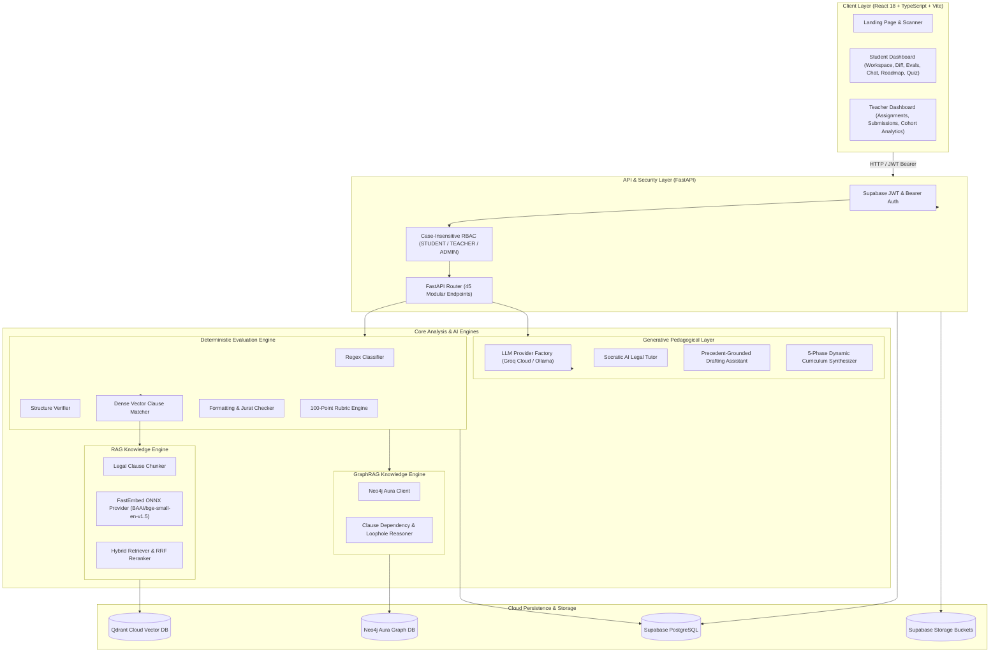

# DraftForge — Evidence-Grounded Legal Drafting Education & Evaluation Platform

[](https://fastapi.tiangolo.com)
[](https://react.dev)
[](https://vitejs.dev)
[](https://tailwindcss.com)
[](https://qdrant.tech)
[](https://neo4j.com)
[](https://supabase.com)
[-F55036.svg?style=flat)](https://groq.com)
[](https://qdrant.github.io/fastembed/)
[](https://opensource.org/licenses/MIT)

> **DraftForge** is an advanced AI-powered, evidence-grounded legal education and assessment platform tailored specifically for Indian statutory drafting pedagogy. Unlike traditional LLM wrappers that evaluate legal documents probabilistically, DraftForge strictly decouples **100% deterministic, rubric-based evaluation** from **generative pedagogical AI assistance**.

---

## 📚 Full documentation

This README is the overview. The complete documentation — architecture
deep-dives, end-to-end flows with sequence diagrams, the security and threat
models, runbooks and decision records — lives in [`docs/`](docs/) as a VitePress
site.

```bash
cd docs && npm install && npm run dev
```

| Start here | For |
| :--- | :--- |
| [Quickstart](docs/guide/quickstart.md) | Getting it running locally |
| [System overview](docs/architecture/overview.md) | How the pieces fit together |
| [Flows](docs/flows/overview.md) | Following a request end to end |
| [Security model](docs/security/model.md) | Trust boundaries and how they are enforced |
| [Runbooks](docs/operations/runbooks.md) | Diagnosing production |
| [Decision records](docs/reference/decisions.md) | Why things are the way they are |

---

## 📌 Table of Contents

- [1. Overview & Problem Statement](#1-overview--problem-statement)
- [2. Why DraftForge is Different](#2-why-draftforge-is-different)
- [3. System Architecture](#3-system-architecture)
- [4. Complete Technology Stack](#4-complete-technology-stack)
- [5. Subsystem Deep-Dives](#5-subsystem-deep-dives)
  - [5.1 Deterministic Rubric Evaluation Engine](#51-deterministic-rubric-evaluation-engine)
  - [5.2 Hybrid RAG Knowledge Retrieval Pipeline](#52-hybrid-rag-knowledge-retrieval-pipeline)
  - [5.3 GraphRAG & Neo4j Knowledge Graph](#53-graphrag--neo4j-knowledge-graph)
  - [5.4 Generative AI Layer & Socratic Legal Tutor](#54-generative-ai-layer--socratic-legal-tutor)
  - [5.5 Dynamic Personalized Learning Roadmaps](#55-dynamic-personalized-learning-roadmaps)
  - [5.6 Interactive Quizzes & Drafting Exercises](#56-interactive-quizzes--drafting-exercises)
  - [5.7 Faculty Coursework & Submissions Auditor](#57-faculty-coursework--submissions-auditor)
  - [5.8 Authentication & Role-Based Access Control (RBAC)](#58-authentication--role-based-access-control-rbac)
- [6. Complete API Endpoint Inventory (45 Endpoints)](#6-complete-api-endpoint-inventory-45-endpoints)
- [7. PostgreSQL Database Architecture & Migrations](#7-postgresql-database-architecture--migrations)
- [8. Repository Directory Structure](#8-repository-directory-structure)
- [9. Environment Variables Configuration](#9-environment-variables-configuration)
- [10. Complete Local Setup & Quickstart](#10-complete-local-setup--quickstart)
- [11. Testing & Build Verification](#11-testing--build-verification)
- [12. Docker & Deployment Instructions](#12-docker--deployment-instructions)
- [13. Security Architecture](#13-security-architecture)
- [14. Current Implementation Status](#14-current-implementation-status)
- [15. Known Limitations & Future Improvements](#15-known-limitations--future-improvements)
- [16. License](#16-license)

---

## 1. Overview & Problem Statement

Legal drafting in Indian jurisprudence requires strict adherence to statutory structure, verified procedural jurats, mandatory consideration recitals, and precise jurisdictional declarations. Law students and junior advocates often struggle due to:

1. **Subjective and Inconsistent Assessment**: Traditional grading is manual, slow, and heavily dependent on individual examiner preferences.
2. **LLM Hallucinations in LegalTech**: Off-the-shelf generative AI models regularly hallucinate statutory sections (e.g. confusing Section 138 of the Negotiable Instruments Act with Section 73 of the Indian Contract Act) and cannot provide verifiable citations.
3. **Absence of Grounded Evidence**: Generative AI offers vague feedback without citing standard precedents, statutory rules, or authoritative court precedents.
4. **Pedagogical Flaws in AI**: Standard AI tools rewrite drafts for students, depriving them of the cognitive effort required to learn statutory phrasing and legal logic.

**DraftForge** solves this by establishing a verifiable, evidence-grounded workflow where every score is backed by exact statutory rubric criteria, vector search evidence, and knowledge graph relationship traversals.

---

## 2. Why DraftForge is Different

| Dimension | Generic LLM Chatbots / Wrappers | DraftForge Platform |
| :--- | :--- | :--- |
| **Scoring Consistency** | Probabilistic (scores fluctuate on every run) | **100% Deterministic (Zero variance across identical runs)** |
| **Evidence Grounding** | Untraceable model weights | **Hybrid Dense (Qdrant) + Lexical search with exact page/section citations** |
| **Prerequisite Logic** | None (evaluates clauses in isolation) | **GraphRAG (Neo4j Aura) traversing statutory dependency topologies** |
| **AI Pedagogy** | Re-writes drafts directly | **Socratic AI Tutor that questions and guides the student** |
| **Document Types** | Generic text prompts | **Tailored Indian legal formats (Affidavits, Employment, Rent, Notices)** |
| **Faculty Control** | None | **Full Coursework portal with submission diffs and grade overrides** |

---

## 3. System Architecture



---

## 4. Complete Technology Stack

### Backend
- **Framework**: FastAPI `0.115+` (Python `3.11` / `3.12` / `3.13`)
- **Data Validation & Schemas**: Pydantic v2 with `ConfigDict(extra="ignore")`
- **Vector Search Engine**: Qdrant Cloud (`legal_reference_corpus` collection)
- **Knowledge Graph Database**: Neo4j Aura (`neo4j+s://` protocol)
- **Relational Storage & Auth**: Supabase Managed PostgreSQL & Supabase Auth JWT
- **Local Embeddings**: FastEmbed ONNX runtime (`BAAI/bge-small-en-v1.5`, 384 dimensions)
- **LLM Providers**: Groq Cloud API (`qwen/qwen3.6-27b`, `llama-3.3-70b-versatile`) with local Ollama fallback support
- **HTTP & Testing**: HTTPX, Starlette TestClient, Pytest, Pytest-Asyncio

### Frontend
- **Framework**: React 18 with TypeScript
- **Build Tool & Dev Server**: Vite 5.4
- **Styling**: Tailwind CSS 3.4 with custom glassmorphism design system
- **Icons & UI Components**: Lucide React
- **HTTP Client**: Axios with automated bearer token interceptor and 60-second timeout handling

---

## 5. Subsystem Deep-Dives

### 5.1 Deterministic Rubric Evaluation Engine
The evaluation engine executes without making probabilistic LLM calls for grading, ensuring identical scores on repeated runs.

```
+-----------------------------------------------------------------------------------+
|                           100-Point Calibrated Rubric                             |
+------------------------------------+----------------------------------------------+
| 1. Structural Demarcation (25 pts) | Header, Cause Title, Deponent, Verification  |
| 2. Mandatory Clause Coverage (50 pts)| Essential statutory covenants & terms        |
| 3. Formatting & Precision (25 pts) | Paragraph numbering, indentation, formal tone|
| 4. Gap Penalties (Deductions)      | Missing statutory warnings, omitted jurats   |
+------------------------------------+----------------------------------------------+
```

Supported Indian Document Types:
1. `AFFIDAVIT_OF_CHARACTER`: Evaluates deponent oath, criminal non-conviction, verification jurat, and state stamp duty warnings.
2. `EMPLOYMENT_AGREEMENT`: Evaluates appointment, remuneration, confidentiality, termination notice, and Section 27 Contract Act non-compete restraint boundaries.
3. `RENT_AGREEMENT`: Evaluates lessor/lessee demarcation, security deposit, tenancy term, escalation, and dispute resolution.
4. `LEGAL_NOTICE`: Evaluates advocate cause title, transaction narrative, Section 138 NI Act / Section 80 CPC demand, 15-day statutory cure period, and consequences of non-compliance.

### 5.2 Hybrid RAG Knowledge Retrieval Pipeline
- **Legal Clause Chunker**: Splits reference standard documents preserving legal clause headings, sub-clauses, and schedules.
- **FastEmbed Provider**: Embeds text using local ONNX embeddings (`BAAI/bge-small-en-v1.5`) with a singleton memory cache for sub-second retrieval.
- **Qdrant Vector Search**: Retrieves top-k authoritative reference clauses with exact metadata (`source_document`, `section`, `page_number`).
- **Reciprocal Rank Fusion (RRF)**: Merges dense vector similarity with keyword/section queries to ensure high retrieval accuracy.

### 5.3 GraphRAG & Neo4j Knowledge Graph
- Neo4j Aura models the relationship between legal document structures and Indian statutory acts.
- **Cypher Traversal**: Validates if prerequisite clauses exist before dependent clauses are included (e.g. an *Arbitration Clause* without a *Governing Law & Jurisdiction* clause is flagged as an enforceability loophole).
- **Severity Mapping**: Categorizes loopholes into `CRITICAL`, `MAJOR`, and `MINOR` with statutory remediation guidance.

### 5.4 Generative AI Layer & Socratic Legal Tutor
- **Socratic Legal Tutor (`/api/v1/chat/send`)**: Engages students in multi-turn pedagogical dialogue. When a student asks for an answer, the tutor asks guiding statutory questions based on the document type.
- **Drafting Assistant (`/api/v1/ai/assist-drafting`)**: Assists in drafting specific clauses with Indian legal phrasing while adhering to precedent constraints.
- **Evaluation Explainer (`/api/v1/ai/explain-evaluation`)**: Breaks down evaluation findings into actionable legal study points.

### 5.5 Dynamic Personalized Learning Roadmaps
- Gathers the student's evaluated weak skills from PostgreSQL.
- Generates a customized 5-phase learning trajectory with distinct statutory titles and drafting tasks.
- Students track progress by marking milestones complete in real time.

### 5.6 Interactive Quizzes & Drafting Exercises
- **MCQ Quizzes**: Covers statutory knowledge, drafting errors, and Indian court precedents.
- **Scenario Drafting Exercises**: Open-ended drafting prompts assessed deterministically against a keyword and rubric checklist.

### 5.7 Faculty Coursework & Submissions Auditor
- Teachers create assignments with document type constraints, deadlines, and custom rubric parameters.
- Review student draft versions side-by-side with additions/deletions diffs.
- Override evaluation scores with custom faculty notes.
- View class-wide cohort analytics and weak-skill distributions.

### 5.8 Authentication, Roles & Class Onboarding
- **Invitation-based onboarding.** Students do not self-register. An instructor creates a class, adds students by email, and each receives an invitation to set their own password. Only a SHA-256 hash of the invitation token is stored.
- **Gated faculty registration.** Instructor accounts require an institution-issued registration code, itself stored hashed and use-limited.
- **Server-assigned roles.** The role never travels in a request; it is read from the database on every call.
- **Local JWT verification** against the project's cached JWKS, with no per-request round trip to Supabase Auth.
- **Class-scoped data.** Assignments, submissions, cohort analytics and the leaderboard are all scoped through class membership rather than spanning every user on the platform.

See [Onboarding & invitations](docs/flows/onboarding.md) for the full flow.

---

## 6. API Endpoint Inventory

DraftForge exposes **60 endpoints** under `app.main:app`. The table below lists
the original 45; the 15 added for class management, invitations and session
handling are documented in the [API reference](docs/reference/api.md).

> Two entries below have changed access since: `POST /api/v1/auth/register` no
> longer accepts a `role` (it always creates a student), and
> `GET /api/v1/health` now requires authentication.

| # | Group | Method | Path | Role / Access | Description |
| :-: | :--- | :--- | :--- | :--- | :--- |
| 1 | **System** | `GET` | `/` | Public | System platform info and docs links |
| 2 | **System** | `GET` | `/health` | Public | Root liveness health check |
| 3 | **System** | `GET` | `/api/v1/health` | Public | Detailed API telemetry & service health |
| 4 | **Auth** | `POST` | `/api/v1/auth/register` | Public | Register student or teacher account |
| 5 | **Auth** | `POST` | `/api/v1/auth/login` | Public | Login with email/password and get JWT |
| 6 | **Documents** | `POST` | `/api/v1/documents/classify` | Public / Optional | Auto-classify legal text snippet |
| 7 | **Documents** | `GET` | `/api/v1/documents/reference` | Student / Teacher | List reference standard precedents |
| 8 | **Documents** | `POST` | `/api/v1/documents/reference/upload` | Teacher / Admin | Upload master reference PDF/DOCX |
| 9 | **Drafts** | `POST` | `/api/v1/drafts` | Student | Create new student draft from raw text |
| 10 | **Drafts** | `POST` | `/api/v1/drafts/upload` | Student | Upload draft file (PDF, DOCX, TXT) |
| 11 | **Drafts** | `GET` | `/api/v1/drafts` | Student | List all drafts of authenticated student |
| 12 | **Drafts** | `GET` | `/api/v1/drafts/{draft_id}` | Student | Retrieve full draft details and revisions |
| 13 | **Drafts** | `POST` | `/api/v1/drafts/{draft_id}/versions` | Student | Append next draft revision (v2, v3) |
| 14 | **Drafts** | `GET` | `/api/v1/drafts/{draft_id}/compare` | Student | Generate diff between two draft versions |
| 15 | **Evaluations** | `POST` | `/api/v1/evaluations` | Student | Trigger deterministic evaluation |
| 16 | **Evaluations** | `GET` | `/api/v1/evaluations/{evaluation_id}` | Student / Teacher | Get full rubric evaluation report |
| 17 | **Loopholes** | `GET` | `/api/v1/loopholes/{evaluation_id}` | Student / Teacher | Run GraphRAG loophole analysis |
| 18 | **AI Assist** | `POST` | `/api/v1/ai/explain-evaluation` | Student | Synthesize AI explanation for finding |
| 19 | **AI Assist** | `POST` | `/api/v1/ai/assist-drafting` | Student | Precedent-grounded clause drafting |
| 20 | **RAG** | `POST` | `/api/v1/rag/retrieve` | Student / Teacher | Vector search Qdrant reference corpus |
| 21 | **Chat** | `POST` | `/api/v1/conversations` | Student | Initialize tutoring conversation |
| 22 | **Chat** | `GET` | `/api/v1/conversations` | Student | List student's conversation sessions |
| 23 | **Chat** | `GET` | `/api/v1/conversations/{id}/messages`| Student | Get message history of a conversation |
| 24 | **Chat** | `POST` | `/api/v1/chat/send` | Student | Send message to Socratic AI Tutor |
| 25 | **Skills** | `GET` | `/api/v1/skills/my-skills` | Student | Retrieve student skill proficiencies |
| 26 | **Roadmap** | `GET` | `/api/v1/roadmap` | Student | Get current active learning roadmap |
| 27 | **Roadmap** | `POST` | `/api/v1/roadmap/generate` | Student | Synthesize new personalized roadmap |
| 28 | **Roadmap** | `PATCH`| `/api/v1/roadmap/items/{id}/complete`| Student | Mark roadmap milestone completed |
| 29 | **Quizzes** | `GET` | `/api/v1/quizzes` | Student | List drafting quizzes for document type |
| 30 | **Quizzes** | `GET` | `/api/v1/quizzes/{quiz_id}` | Student | Retrieve quiz questions and options |
| 31 | **Quizzes** | `POST` | `/api/v1/quizzes/submit` | Student | Submit quiz answers for scoring |
| 32 | **Exercises** | `GET` | `/api/v1/exercises` | Student | List drafting practice exercises |
| 33 | **Exercises** | `GET` | `/api/v1/exercises/{exercise_id}` | Student | Get exercise scenario, hints & rubric |
| 34 | **Exercises** | `POST` | `/api/v1/exercises/attempt` | Student | Submit exercise attempt for assessment |
| 35 | **Exercises** | `GET` | `/api/v1/exercises/my-attempts` | Student | Get student's exercise attempt history |
| 36 | **Progress** | `GET` | `/api/v1/progress` | Student | Student score trends & analytics |
| 37 | **Leaderboard**| `GET` | `/api/v1/leaderboard` | Student / Teacher | Cohort drafting leaderboard |
| 38 | **Assignments**| `POST` | `/api/v1/assignments` | Teacher / Admin | Create coursework assignment |
| 39 | **Assignments**| `GET` | `/api/v1/assignments` | Student | List published assignments |
| 40 | **Assignments**| `GET` | `/api/v1/assignments/{id}` | Student / Teacher | Get assignment details & instructions |
| 41 | **Teachers** | `GET` | `/api/v1/teachers/assignments` | Teacher | List assignments created by teacher |
| 42 | **Submissions**| `POST` | `/api/v1/submissions` | Student | Submit draft version for assignment |
| 43 | **Submissions**| `GET` | `/api/v1/submissions/assignment/{id}`| Teacher | Audit submissions for an assignment |
| 44 | **Submissions**| `POST` | `/api/v1/submissions/{id}/override` | Teacher | Override evaluation score & notes |
| 45 | **Analytics** | `GET` | `/api/v1/analytics/cohort` | Teacher / Admin | Aggregated class-wide cohort analytics |

---

## 7. PostgreSQL Database Architecture & Migrations

The relational schema is organized into 6 sequential SQL migrations (newest first):

| Migration | File | Tables Created | Description |
| :--- | :--- | :--- | :--- |
| **006** | `006_classes_and_invitations.sql` | `classes`, `class_enrollments`, `invitations`, `faculty_registration_codes`, `email_outbox` | Teacher-driven rosters, hashed single-use invitation tokens, gated faculty registration, and email delivery records. Adds `assignments.class_id`. |
| **005** | `005_row_level_security.sql` | `audit_log` | Row-level security on all 23 tables, `SECURITY DEFINER` ownership helpers, column grants withholding answer keys, `profiles.is_active`, and an append-only audit trail. |
| **001** | `001_initial_schema.sql` | `profiles`, `reference_documents`, `drafts`, `draft_versions`, `evaluations`, `evaluation_evidence`, `skills`, `student_skills`, `skill_history`, `roadmaps`, `roadmap_items` | User profiles, master reference precedents, multi-version drafts, rubric evaluations, evidence citations, skill proficiencies, and roadmaps. |
| **002** | `002_memory_and_summaries.sql` | `conversations`, `messages`, `user_memories`, `document_memories` | Multi-turn chat conversations, message history, user pedagogical memories, and document context summaries. |
| **003** | `003_exercises_and_quizzes.sql` | `exercises`, `exercise_attempts`, `quizzes`, `quiz_questions`, `quiz_attempts` | Interactive drafting scenarios, attempt grading, MCQ question banks, and quiz attempt scoring breakdowns. |
| **004** | `004_assignments_and_submissions.sql` | `assignments`, `submissions` | Faculty coursework management, student draft submissions, and teacher score overrides. |

---

## 8. Repository Directory Structure

```
DraftForge/
├── backend/
│   ├── app/
│   │   ├── ai/
│   │   │   ├── agents/             # Socratic Tutor, Drafting, Roadmap, Loophole agents
│   │   │   ├── embeddings/         # FastEmbed ONNX model provider with singleton cache
│   │   │   ├── evaluation/         # Document evaluators, rubric loaders, scoring engine
│   │   │   ├── graph/              # Neo4j schema initialization, Cypher query execution
│   │   │   ├── llm/                # Groq Cloud & Ollama multi-model provider factory
│   │   │   ├── memory/             # User and document conversational memory
│   │   │   └── rag/                # Legal clause chunking, metadata builder, hybrid retriever
│   │   ├── api/v1/                 # Modular FastAPI routers (45 endpoints)
│   │   ├── core/                   # Constants, exception handlers, logging, security
│   │   ├── db/                     # Supabase, Qdrant, Neo4j connection clients & repositories
│   │   ├── models/                 # Pydantic schemas and database models
│   │   ├── pipelines/              # Evaluation, skill progression, roadmap pipelines
│   │   ├── services/               # Business service layer
│   │   ├── utils/                  # File hashing, text processing utilities
│   │   ├── config.py               # Pydantic BaseSettings configuration
│   │   ├── dependencies.py         # Authentication & RBAC dependency injectors
│   │   └── main.py                 # FastAPI application lifespan & CORS middleware
│   ├── migrations/                 # 001 to 004 PostgreSQL DDL migrations
│   ├── rubrics/                    # JSON rubric configurations for all 4 document types
│   ├── scripts/                    # Automated 37-endpoint test suite & graph seeder
│   ├── tests/                      # Pytest unit, integration, and evaluation benchmarks
│   ├── .env.example                # Template backend environment variables
│   └── requirements.txt            # Python backend dependencies
├── frontend/
│   ├── src/
│   │   ├── components/
│   │   │   ├── ai/                 # 3D AI Core Orb, Evaluation Modal, Roadmap Generator
│   │   │   ├── common/             # Navbar, Sidebar, Toast, Health & Classifier modals
│   │   │   ├── landing/            # Cinematic 3D Hero, interactive document scanner
│   │   │   ├── student/            # Workspace, Evaluation Card, Loophole, Chat, Quiz, Roadmap
│   │   │   └── teacher/            # Assignment Manager, Submissions Auditor, Cohort Analytics
│   │   ├── context/                # AuthContext (JWT bearer management & user state)
│   │   ├── pages/                  # LandingPage, AuthPage, StudentDashboard, TeacherDashboard
│   │   ├── services/               # Axios apiClient with interceptors and typed methods
│   │   ├── types/                  # TypeScript interfaces matching backend schemas
│   │   ├── App.tsx                 # Main routing and layout shell
│   │   └── main.tsx                # Frontend entry point
│   ├── .env.example                # Template frontend environment variables
│   ├── package.json                # NPM dependencies
│   ├── tailwind.config.js          # Custom glassmorphism styling and theme
│   ├── tsconfig.json               # TypeScript compiler options
│   └── vite.config.ts              # Vite bundler configuration
└── README.md                       # Repository documentation
```

---

## 9. Environment Variables Configuration

### Backend (`backend/.env`)

```env
# Application Info
APP_NAME="LegalDraft AI Engine"
APP_VERSION="1.0.0"
DEBUG=False
HOST="0.0.0.0"
PORT=8000
ENVIRONMENT="production"
ALLOWED_ORIGINS="http://localhost:5173,http://localhost:3000,https://draftforge-2-1.onrender.com"

# Supabase Managed Cloud
SUPABASE_URL="https://YOUR_PROJECT_ID.supabase.co"
SUPABASE_ANON_KEY="YOUR_SUPABASE_ANON_KEY"
SUPABASE_SERVICE_ROLE_KEY="YOUR_SUPABASE_SERVICE_ROLE_KEY"
SUPABASE_JWT_SECRET="YOUR_SUPABASE_JWT_SECRET"

# Supabase Storage Buckets
SUPABASE_REFERENCE_BUCKET="reference-documents"
SUPABASE_DRAFT_BUCKET="student-drafts"
SUPABASE_SUBMISSION_BUCKET="assignment-submissions"

# Neo4j Aura Managed Cloud
NEO4J_URI="neo4j+s://YOUR_INSTANCE_ID.databases.neo4j.io"
NEO4J_USERNAME="neo4j"
NEO4J_PASSWORD="YOUR_NEO4J_PASSWORD"
NEO4J_DATABASE="neo4j"

# Qdrant Managed Cloud
QDRANT_URL="https://YOUR_CLUSTER_ID.aws.cloud.qdrant.io:6333"
QDRANT_API_KEY="YOUR_QDRANT_API_KEY"
QDRANT_COLLECTION_NAME="legal_reference_corpus"

# LLM Providers
LLM_PROVIDER="groq"
GROQ_API_KEY="gsk_YOUR_GROQ_API_KEY"
GROQ_MODEL="qwen/qwen3.6-27b"
OLLAMA_BASE_URL="http://localhost:11434"
OLLAMA_MODEL="mistral:latest"

# Embeddings Configuration
EMBEDDING_PROVIDER="fastembed"
EMBEDDING_MODEL="BAAI/bge-small-en-v1.5"
```

### Frontend (`frontend/.env`)

```env
VITE_API_URL=http://localhost:8000/api/v1
```

---

## 10. Complete Local Setup & Quickstart

### Prerequisites
- **Python**: `3.11` or higher
- **Node.js**: `18.x` or higher and `npm`
- **Managed Cloud Accounts**:
  - [Supabase](https://supabase.com) (PostgreSQL & Auth)
  - [Qdrant Cloud](https://cloud.qdrant.io) (Vector Database)
  - [Neo4j Aura](https://neo4j.com/cloud/aura/) (Graph Database)
  - [Groq Cloud](https://console.groq.com) (LLM Inference)

---

### Step 1: Database & Cloud Setup

1. **Supabase**:
   - Create a new project in Supabase.
   - Run the SQL scripts in `backend/migrations/` sequentially (`001`, `002`, `003`, `004`) in the Supabase SQL Editor.
   - Create storage buckets named `reference-documents`, `student-drafts`, and `assignment-submissions`.
2. **Qdrant Cloud**:
   - Create a Qdrant cluster.
   - The backend automatically initializes the `legal_reference_corpus` collection with 384 dimensions (Cosine distance).
3. **Neo4j Aura**:
   - Create a free Neo4j AuraDB instance.
   - Note the URI, username, and password.
4. **Groq Cloud**:
   - Create an API key at [Groq Console](https://console.groq.com).

---

### Step 2: Backend Setup

```powershell
# 1. Navigate to backend directory
cd backend

# 2. Create and activate Python virtual environment
python -m venv venv
.\venv\Scripts\Activate.ps1

# 3. Install dependencies
pip install -r requirements.txt

# 4. Configure environment variables
cp .env.example .env
# Edit .env with your actual credentials

# 5. Start FastAPI development server
uvicorn app.main:app --reload --host 0.0.0.0 --port 8000
```

The backend is accessible at:
- **API Root**: `http://localhost:8000`
- **Interactive Swagger Docs**: `http://localhost:8000/docs`
- **Redoc Documentation**: `http://localhost:8000/redoc`

---

### Step 3: Frontend Setup

```powershell
# 1. Open a new terminal and navigate to frontend
cd frontend

# 2. Install dependencies
npm install

# 3. Configure environment variables
cp .env.example .env
# Ensure VITE_API_URL=http://localhost:8000/api/v1

# 4. Start Vite development server
npm run dev
```

The frontend application will be running at `http://localhost:5173`.

---

## 11. Testing & Build Verification

### 1. Run Complete Automated Endpoint Audit (37 Endpoint Tests)

```powershell
cd backend
.\venv\Scripts\python.exe scripts/test_all_endpoints.py
```

```text
================================================================================
COMPREHENSIVE BACKEND ENDPOINT AUDIT & VERIFICATION
================================================================================
[GET  ] /                                             -> Status: 200 (WORKING)
[GET  ] /health                                       -> Status: 200 (WORKING)
[GET  ] /api/v1/health                                -> Status: 200 (WORKING)
[POST ] /api/v1/documents/classify                    -> Status: 200 (WORKING)
[GET  ] /api/v1/documents/reference                   -> Status: 200 (WORKING)
[POST ] /api/v1/drafts                                -> Status: 201 (WORKING)
[GET  ] /api/v1/drafts                                -> Status: 200 (WORKING)
[GET  ] /api/v1/drafts/{id}                           -> Status: 200 (WORKING)
[POST ] /api/v1/drafts/{id}/versions                  -> Status: 201 (WORKING)
[GET  ] /api/v1/drafts/{id}/compare?v1=1&v2=2         -> Status: 200 (WORKING)
[POST ] /api/v1/evaluations                           -> Status: 201 (WORKING)
[GET  ] /api/v1/evaluations/{id}                      -> Status: 200 (WORKING)
[POST ] /api/v1/ai/explain-evaluation                 -> Status: 200 (WORKING)
[GET  ] /api/v1/loopholes/{id}                        -> Status: 200 (WORKING)
[POST ] /api/v1/ai/assist-drafting                    -> Status: 200 (WORKING)
[POST ] /api/v1/rag/retrieve                          -> Status: 200 (WORKING)
[POST ] /api/v1/conversations                         -> Status: 201 (WORKING)
[GET  ] /api/v1/conversations                         -> Status: 200 (WORKING)
[GET  ] /api/v1/conversations/{id}/messages           -> Status: 200 (WORKING)
[POST ] /api/v1/chat/send                             -> Status: 200 (WORKING)
[GET  ] /api/v1/skills/my-skills                      -> Status: 200 (WORKING)
[GET  ] /api/v1/roadmap                               -> Status: 200 (WORKING)
[POST ] /api/v1/roadmap/generate                      -> Status: 201 (WORKING)
[PATCH] /api/v1/roadmap/items/{id}/complete           -> Status: 200 (WORKING)
[GET  ] /api/v1/quizzes                               -> Status: 200 (WORKING)
[GET  ] /api/v1/exercises                             -> Status: 200 (WORKING)
[GET  ] /api/v1/exercises/my-attempts                 -> Status: 200 (WORKING)
[GET  ] /api/v1/progress                              -> Status: 200 (WORKING)
[GET  ] /api/v1/leaderboard                           -> Status: 200 (WORKING)
[POST ] /api/v1/assignments                           -> Status: 201 (WORKING)
[GET  ] /api/v1/teachers/assignments                  -> Status: 200 (WORKING)
[GET  ] /api/v1/assignments                           -> Status: 200 (WORKING)
[GET  ] /api/v1/assignments/{id}                      -> Status: 200 (WORKING)
[POST ] /api/v1/submissions                           -> Status: 201 (WORKING)
[GET  ] /api/v1/submissions/assignment/{id}           -> Status: 200 (WORKING)
[POST ] /api/v1/submissions/{id}/override             -> Status: 200 (WORKING)
[GET  ] /api/v1/analytics/cohort                      -> Status: 200 (WORKING)
================================================================================
ALL TESTS COMPLETED. SUMMARY:
Total Tested: 37 | Working: 37 | Non-200: 0
================================================================================
```

### 2. Run Pytest Suite

```powershell
cd backend
.\venv\Scripts\pytest.exe -v
```

```text
============================= test session starts =============================
tests/evaluation/test_rag_quality.py .                                   [  7%]
tests/evaluation/test_scoring_accuracy.py .                              [ 15%]
tests/integration/test_auth_api.py .                                     [ 23%]
tests/integration/test_evaluation_flow.py ..                             [ 38%]
tests/unit/test_chunker.py .                                             [ 46%]
tests/unit/test_classifier.py ...                                        [ 69%]
tests/unit/test_parser.py ..                                             [ 84%]
tests/unit/test_rubric_loader.py .                                       [ 92%]
tests/unit/test_scoring_engine.py .                                      [100%]
============================= 13 passed in 32.79s =============================
```

### 3. Run Frontend Type Checking and Production Build

```powershell
cd frontend
npm run build
```

```text
> draftforge-frontend@1.0.0 build
> tsc && vite build

vite v5.4.21 building for production...
✓ 1569 modules transformed.
dist/index.html                   1.11 kB │ gzip:   0.64 kB
dist/assets/index-Bpey1NWi.css   59.87 kB │ gzip:   9.92 kB
dist/assets/index-Cbnb7AnK.js   473.03 kB │ gzip: 120.45 kB
✓ built in 12.89s (0 TypeScript errors)
```

---

## 12. Docker & Deployment Instructions

### Render Deployment Configuration

1. **Backend Web Service**:
   - **Environment**: Python 3.11+
   - **Build Command**: `pip install -r requirements.txt`
   - **Start Command**: `uvicorn app.main:app --host 0.0.0.0 --port $PORT`
   - **Environment Variables**: Populate all keys from `backend/.env.example`.
2. **Frontend Static Site**:
   - **Build Command**: `npm install && npm run build`
   - **Publish Directory**: `dist`
   - **Environment Variables**: `VITE_API_URL=https://your-backend-subdomain.onrender.com`

---

## 13. Security Architecture

> Full detail: **[Security model](docs/security/model.md)** · **[Threat model](docs/security/threat-model.md)** · **[Row-level security](docs/security/row-level-security.md)**

The governing principle: **the token establishes _who_ the caller is; the
database decides _what_ they may do.**

1. **Local JWS verification** — tokens are verified in-process against the project's cached JWKS (or the shared secret for legacy HS256), with full claim validation. No network round trip to Supabase Auth on the request path. The permitted algorithm is derived from the selected key rather than the token header, which is what closes algorithm confusion.
2. **Server-assigned roles** — `role` is absent from every request schema (`extra="forbid"`, so a client sending one fails loudly). The role is read from `profiles` on every request; `ADMIN` is never granted implicitly. Faculty accounts require an institution-issued registration code.
3. **Three authorization layers** — a role gate (may this *kind* of user call this endpoint), a per-resource ownership check (may *this* user touch *this* row), and row-level security in Postgres as the backstop. Unauthorized resources return **404, not 403**, so endpoints cannot be used to enumerate ids.
4. **Row-level security** — enabled on all 23 tables with policies keyed on `auth.uid()`, plus column-level grants that withhold quiz answer keys and exercise model solutions from students.
5. **Rate limiting & budgets** — Redis sliding-window limits per scope (auth, LLM, upload, invite), plus a per-user daily LLM token budget, because request counts cannot bound inference spend. Fails **closed** in production.
6. **Exact-origin CORS** — an explicit allowlist validated at startup; `*` is rejected and https is required in production.
7. **Hardened edge** — HSTS, CSP, `X-Content-Type-Options`, `X-Frame-Options`, referrer and permissions policies, trusted-host checking, streaming body-size limits, and `/docs` disabled in production.
8. **Real upload validation** — content type is established from magic bytes, not the client-supplied header or extension; DOCX is verified as genuine WordprocessingML with decompression-bomb guards; filenames are sanitized before building any storage path.
9. **Sanitized errors** — a uniform `{code, detail, request_id}` envelope. Upstream exception text, storage paths and provider responses are logged, never returned.
10. **Audit trail** — grade overrides, role grants, reference uploads and invitation lifecycle are recorded append-only; the table grants no `UPDATE` or `DELETE`.
11. **No secrets in source** — credentials come from the environment; gitleaks scans full history in CI, and the frontend build output is checked for accidentally bundled secrets.

---

## 14. Current Implementation Status

| Capability / Subsystem | Implementation Status | Notes |
| :--- | :---: | :--- |
| **Deterministic Rubric Evaluation** | **Implemented** | 0-variance reproducible scoring across all 4 document types. |
| **FastEmbed Vector Embeddings** | **Implemented** | Cached ONNX model singleton with sub-second embedding latency. |
| **Qdrant Vector Retrieval** | **Implemented** | Dense vector similarity retrieval over reference collection. |
| **Neo4j GraphRAG Analysis** | **Implemented** | Cypher queries inspect clause dependency graphs and identify legal loopholes. |
| **Socratic AI Legal Tutor** | **Implemented** | Multi-turn conversational tutor using Groq Cloud models. |
| **Personalized Roadmaps** | **Implemented** | Generates dynamic 5-phase statutory drafting trajectories. |
| **Interactive Quizzes** | **Implemented** | MCQ retrieval and attempt evaluation with pedagogical explanations. |
| **Drafting Exercises** | **Implemented** | Open scenario assessment with keyword and rubric matching. |
| **Teacher Coursework & Submissions** | **Implemented** | Assignment publication, student submission, and grade overrides. |
| **Authentication & RBAC** | **Implemented** | Supabase JWT verification with case-insensitive role enforcement. |

---

## 15. Known Limitations & Future Improvements

### Current Limitations
1. **Document Types**: The rubric engine currently supports 4 foundational Indian legal document types (`AFFIDAVIT_OF_CHARACTER`, `EMPLOYMENT_AGREEMENT`, `RENT_AGREEMENT`, `LEGAL_NOTICE`).
2. **Jurisdiction Scope**: The reference standard knowledge base is primarily indexed for Indian statutory laws (Indian Contract Act, Negotiable Instruments Act, CPC, State Stamp Acts).

### Known Security Gaps

Stated openly rather than omitted — see the [threat model](docs/security/threat-model.md) for the full assessment.

- **Repositories still use the Supabase service-role key**, which is `BYPASSRLS`. The policies in migration 005 currently defend against key leakage and direct database access rather than the API's own queries. `get_user_scoped_client()` exists for the migration.
- **Tokens are stored in `localStorage`**, so an XSS would expose them. Mitigated by a strict CSP; httpOnly cookies are the real fix.
- **No prompt-injection defences** on the tutor path yet.
- **No MFA** on instructor accounts, which can alter academic records.

### Future Roadmap
- [ ] Expand document types to include Commercial Bail Applications, Writ Petitions, and Sale Deeds.
- [ ] Add real-time collaborative draft editing between student pairs.
- [ ] Implement multi-jurisdiction rule packs (UK Common Law, Singapore Commercial Law).
- [ ] Integrate automated OCR for handwritten affidavit scans.

---

## 16. License

This project is licensed under the **MIT License**. See the `LICENSE` file for details.
