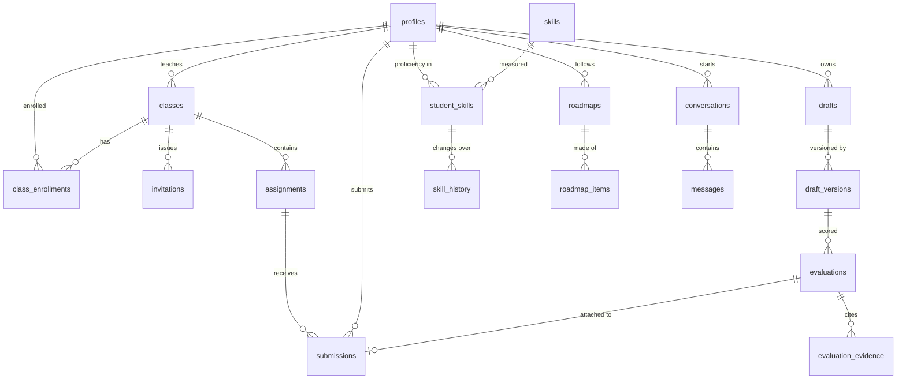
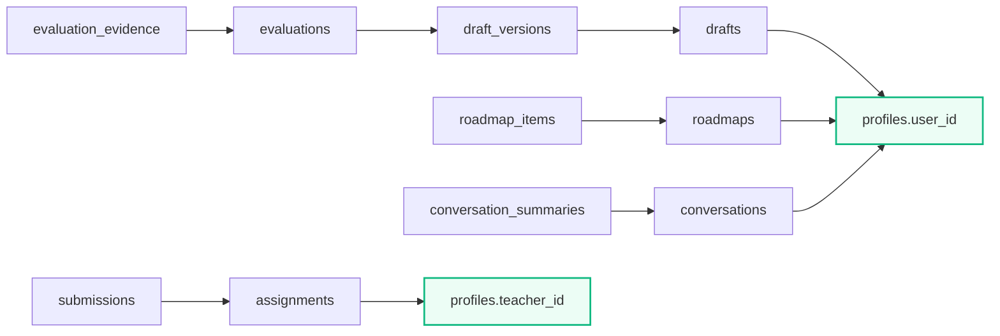

# Data model

## Entity relationships

## Tables by migration

| Migration | Adds |
| :--- | :--- |
| `001_initial_schema` | `profiles`, `reference_documents`, `drafts`, `draft_versions`, `evaluations`, `evaluation_evidence`, `conversations`, `messages`, `skills`, `student_skills`, `skill_history`, `roadmaps`, `roadmap_items` |
| `002_memory_and_summaries` | `conversation_summaries`, `user_learning_memory`, `document_memory` |
| `003_exercises_and_quizzes` | `exercises`, `exercise_attempts`, `quizzes`, `quiz_questions`, `quiz_attempts` |
| `004_assignments_and_submissions` | `assignments`, `submissions` |
| `005_row_level_security` | RLS on all 23 tables, helper functions, `audit_log`, `profiles.is_active`, answer-key column grants |
| `006_classes_and_invitations` | `classes`, `class_enrollments`, `invitations`, `faculty_registration_codes`, `email_outbox`, `assignments.class_id` |

## Ownership paths

Several tables carry no user column, so ownership is only reachable by joining.
Getting this wrong is how the broken-access-control bugs happened.

::: warning
`evaluations` and `roadmap_items` are the two that bit. Both were being matched
on a bare id, which meant any authenticated user could read or modify any row.
Helper functions `owns_draft_version()` and the `roadmap_items` policy encode
these joins so the database enforces them too.
:::

## Notable constraints

| Constraint | Table | Prevents |
| :--- | :--- | :--- |
| `UNIQUE(draft_id, version_number)` | `draft_versions` | Duplicate version numbers |
| `UNIQUE(assignment_id, student_id)` | `submissions` | Double submission |
| `UNIQUE(class_id, email)` | `class_enrollments` | Duplicate roster entries |
| Partial `UNIQUE(class_id, email) WHERE status='PENDING'` | `invitations` | More than one live token per address |
| `CHECK (intended_role <> 'ADMIN')` | `invitations` | Admin ever being granted by invitation |
| `CHECK (email = lower(email))` | enrollments, invitations | Case-variant duplicates |
| `CHECK (use_count <= max_uses)` | `faculty_registration_codes` | Over-redemption |

## Append-only by design

`audit_log` and `draft_versions` are never updated:

- Versions are immutable so a mark always refers to exact text.
- Audit entries have no `UPDATE`/`DELETE` grant, so a compromised session
  cannot rewrite its own history.

## Migrations

Plain SQL, applied in filename order, each idempotent where practical
(`IF NOT EXISTS`, `DROP POLICY IF EXISTS` before `CREATE POLICY`).

CI applies all six against a clean Postgres with the Supabase-specific objects
stubbed, then asserts **no public table lacks RLS** — guarding against a future
migration repeating how 001–004 ended up with none.
