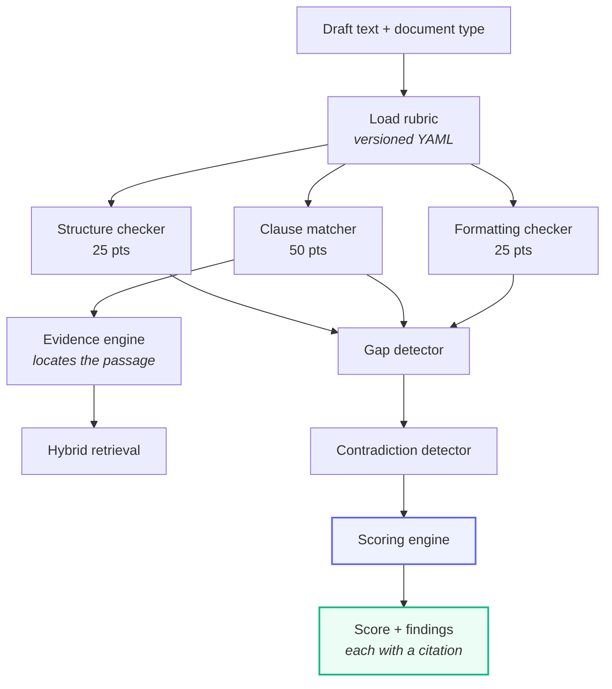

# Evaluation engine

The deterministic scorer. No model inference runs here.

## Pipeline



## Components

| Module | Responsibility |
| :--- | :--- |
| `rubric_loader.py` | Loads and caches versioned rubric YAML |
| `structure_checker.py` | Presence and ordering of structural elements |
| `clause_matcher.py` | Matches required clauses against the draft |
| `evidence_engine.py` | Locates the supporting passage and its citation |
| `formatting_checker.py` | Numbering, indentation, register |
| `gap_detector.py` | Missing statutory warnings and jurats |
| `contradiction_detector.py` | Internally inconsistent provisions |
| `scoring_engine.py` | Aggregates findings into the final mark |
| `document_types/` | Per-type evaluators for the four supported documents |

## Retrieval locates; rules judge

This distinction is what keeps the scorer deterministic despite using vector
search.

Retrieval answers: *which passage of this draft corresponds to the required
termination clause?* That is a semantic question with no exact-match answer.

Whether that passage **satisfies** the criterion is then decided by rules — does
it specify a period, is the period within the statutory minimum, is it mutual.

So a drift in retrieval changes *which evidence is cited*, not whether a clause
passes. That is a visible, debuggable change rather than a silent score shift.

## Rubric structure

```yaml
document_type: EMPLOYMENT_AGREEMENT
rubric_version: "1.2.0"

structure:
  max_points: 25
  elements:
    - id: parties_block
      points: 6
      required: true
      patterns: ["between", "employer", "employee"]

clauses:
  max_points: 50
  required:
    - id: termination_notice_period
      points: 10
      description: "Notice period or payment in lieu"
      keywords: ["terminate", "notice", "days"]
      reference_query: "termination notice period employment India"
```

`rubric_version` is stored on every evaluation. A rubric change does not
silently alter historical marks — the stored version records which rules
produced them.

## Finding statuses

| Status | Meaning | Scoring |
| :--- | :--- | :--- |
| `PASS` | Present and adequate | Full points |
| `PARTIAL` | Present but deficient | Partial points |
| `FAIL` | Absent or inadequate | Zero |
| `WARNING` | Advisory, not scored | No effect |

`PARTIAL` carries most of the teaching value. "You wrote a termination clause
but specified no notice period" is actionable; "termination: 0/10" is not.

## Adding a document type

1. Add the value to `DocumentType` in `app/core/constants.py`.
2. Add the enum value to the `doc_type` Postgres type via a migration.
3. Write the rubric YAML in `app/ai/knowledge/rubrics/`.
4. Add an evaluator in `app/ai/evaluation/document_types/`.
5. Register it in the rubric loader's file map.
6. Add classifier patterns in `app/services/parsing/classifier.py`.
7. Index reference precedents for the new type.
8. Add a scoring-accuracy test with a known-good and known-deficient sample.

Step 8 is not optional. The scorer's value is that its output is reproducible
and defensible; a type with no fixture has neither property demonstrated.
