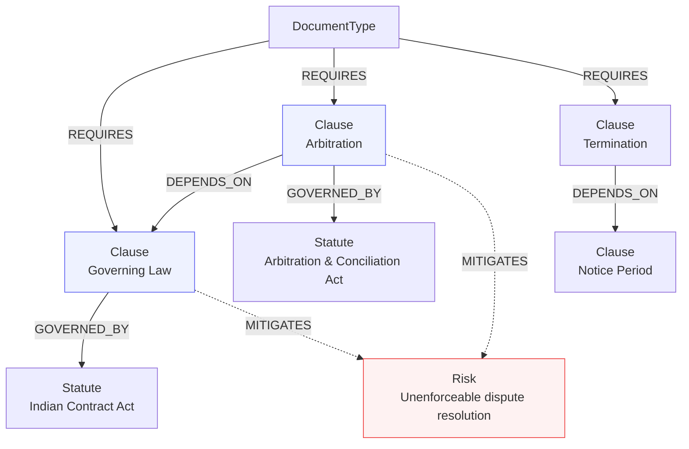
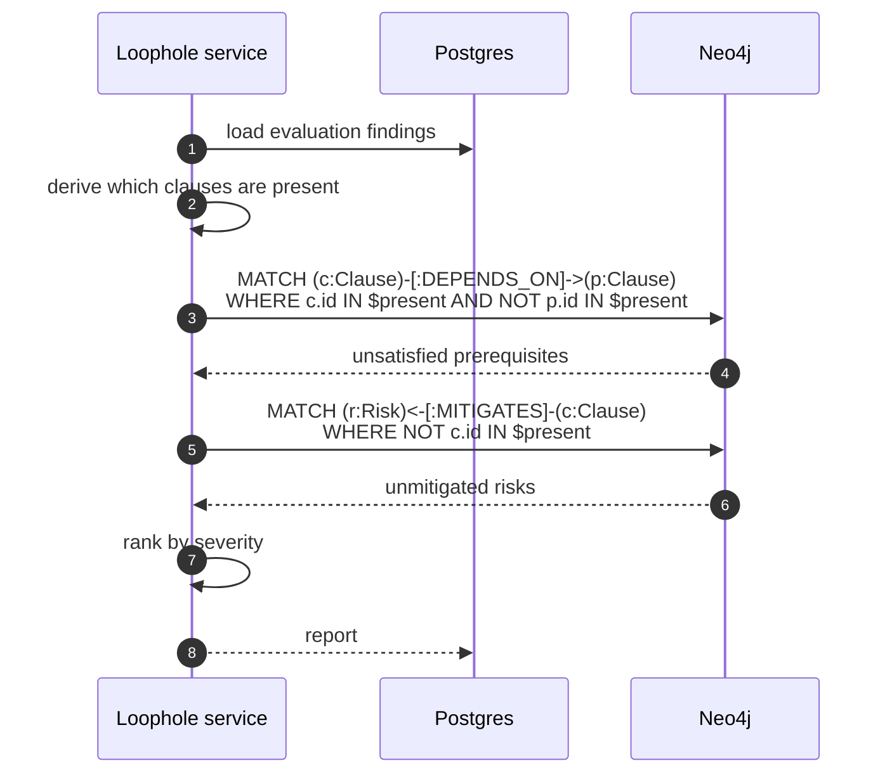

# Knowledge graph

Clause dependency analysis in Neo4j. This is what catches defects that per-clause
checking cannot see.

## The problem it solves

A rubric checks clauses individually. Each may pass in isolation while the
document is still unenforceable, because legal provisions have prerequisites.

An arbitration clause with no governing-law clause is the canonical case: both
statements are individually well-drafted, and the arbitration agreement is
nonetheless difficult to enforce because nothing establishes which law governs
it. No per-clause check can see that — the defect is in the *relationship*.

## Model

| Node | Represents |
| :--- | :--- |
| `DocumentType` | One of the four supported types |
| `Clause` | A statutory provision |
| `Statute` | The Act or section governing it |
| `Risk` | A failure mode a clause guards against |
| `Skill` | A drafting competency, linked to progression |

| Relationship | Meaning |
| :--- | :--- |
| `REQUIRES` | This type must contain this clause |
| `DEPENDS_ON` | This clause is ineffective without that one |
| `GOVERNED_BY` | Statutory authority |
| `MITIGATES` | This clause reduces this risk |

## Detection

## Severity

| Level | Means | Example |
| :--- | :--- | :--- |
| `CRITICAL` | The document likely fails its purpose | Affidavit with no verification jurat |
| `MAJOR` | A provision is unenforceable or ambiguous | Arbitration without governing law |
| `MINOR` | Below best practice | No severability clause |

Each finding carries remediation guidance naming the statute, so the output is
instructional rather than merely a list of complaints.

## Why a graph

The queries above are two- and three-hop traversals over a sparse,
heterogeneous set of relationships. In SQL each becomes a recursive CTE, and
they stop being readable at the third hop — which is where the interesting
defects live.

The graph is small (hundreds of nodes) and read-mostly. It is not there for
scale; it is there because the query shape fits.

## Seeding

Schema constraints and seed topology are applied at startup by
`initialize_graph_constraints()` and `seed_knowledge_graph()`. Both are
idempotent. Seed content lives in `app/ai/graph/seed_knowledge.py`.
