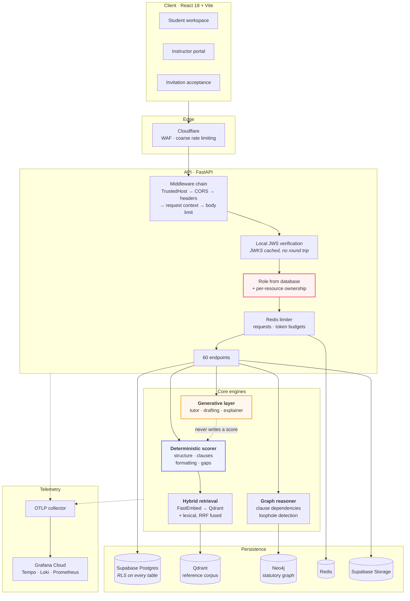
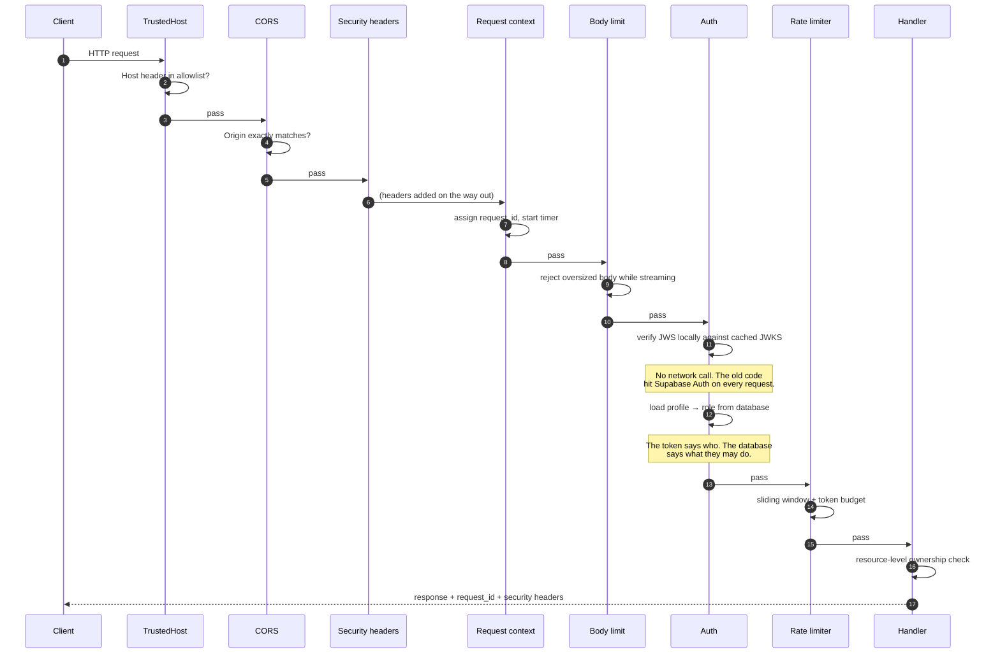

# System overview

## The whole picture



The dotted line from the generative layer to the scorer is the system's central
constraint: it is a prohibition, not a dependency. Nothing in the generative
path can influence a mark.

## Request lifecycle

Every authenticated request passes the same gates, in this order:



Two of these gates exist because of specific defects found in the baseline
audit; see the [security model](/security/model).

## Backend layout

```
backend/app/
├── api/v1/           Routers — thin; no business logic
├── core/             Cross-cutting: auth, authz, rate limiting, audit,
│                     file validation, tokens, errors, logging
├── middleware/       Request context, security headers, body limits
├── observability/    Tracing, metrics, span helpers
├── db/
│   ├── repositories/ Data access, one per aggregate
│   ├── supabase.py   Admin and user-scoped clients
│   ├── qdrant.py     Vector store
│   └── neo4j.py      Graph store
├── services/         Business logic; orchestrates repositories and engines
│   ├── email/        Provider-agnostic delivery + outbox
│   └── parsing/      PDF, DOCX, TXT extraction
├── ai/
│   ├── evaluation/   Deterministic scorer, rubric loader, per-type evaluators
│   ├── rag/          Chunking, embedding, retrieval, reranking
│   ├── graph/        Cypher queries, schema, seeding
│   ├── llm/          Provider factory, prompts
│   ├── agents/       Tutor, drafting, roadmap, loophole
│   └── memory/       Conversation and document memory
├── pipelines/        Multi-step orchestration across engines
└── models/           Pydantic schemas (wire) and DB models
```

The rule that keeps this navigable: **routers do no work.** A router validates
input, calls one service method, and returns. Business logic lives in
`services/`, data access in `db/repositories/`, and anything cross-cutting in
`core/`.

## Layer responsibilities

| Layer | Owns | Must not |
| :--- | :--- | :--- |
| Router | HTTP shape, status codes, dependency wiring | Contain business rules or touch repositories |
| Service | Business rules, orchestration, authorization | Know about HTTP |
| Repository | Queries and persistence | Contain business rules |
| Engine (`ai/`) | Pure computation over inputs | Perform I/O beyond its own store |

## Why these data stores

Four stores sounds like a lot. Each answers a question the others cannot:

**Postgres** holds everything relational and is the authority on identity,
ownership and marks. Row-level security makes it the enforcement boundary, not
just the storage layer.

**Qdrant** answers "which passage of the reference corpus is semantically
closest to this clause?" — a question no `WHERE` clause can express.

**Neo4j** answers "does this clause depend on another clause that is missing?"
Clause dependencies form a graph, and traversing one in SQL means recursive CTEs
that become unreadable at the third hop.

**Redis** holds counters that must be atomic across workers and are worthless
after a day: rate-limit windows and daily token budgets. Putting them in
Postgres would mean write amplification on the hot path for data nobody keeps.

## Further reading

- [Evaluation engine](/architecture/evaluation-engine) — how a score is produced.
- [Retrieval](/architecture/retrieval) — chunking, embedding and fusion.
- [Knowledge graph](/architecture/knowledge-graph) — dependency traversal.
- [Data model](/architecture/data-model) — tables and their relationships.
