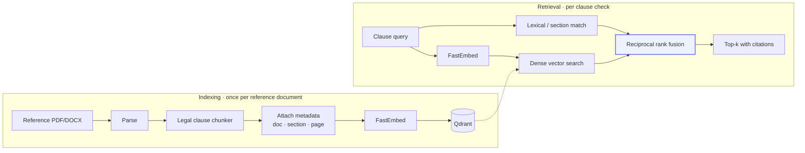

# Retrieval (RAG)

How a clause in a student's draft is matched to authoritative precedent.

## Pipeline

## Chunking

Generic fixed-size chunking is wrong for legal text. Splitting every 512 tokens
cuts clauses in half, so a retrieved fragment may contain a proviso without the
obligation it qualifies — which inverts its meaning.

The chunker splits on clause boundaries instead: numbered clauses, sub-clauses,
schedules and headings. A chunk is a semantically complete provision, and each
carries its heading so a retrieved fragment is self-describing.

## Embeddings

`BAAI/bge-small-en-v1.5`, 384 dimensions, ONNX, run **in-process** via
FastEmbed.

Two reasons this is local rather than an API call:

- It removes a network hop from a path that runs several times per evaluation.
- No draft text is sent to a third party for embedding. Student coursework
  staying inside the deployment is a meaningful property for an education
  platform.

The model is loaded once and cached as a singleton. It downloads on first use,
which is why production keeps a warm instance — a cold start otherwise costs
several seconds on the first student request.

## Fusion

Dense search alone misses exact statutory references — "Section 138" is a
string match, and embeddings are indifferent to the difference between 138 and
139. Lexical alone misses paraphrase, which is most of what students write.

Reciprocal rank fusion combines them without needing the two scoring scales to
be comparable:

$$\text{RRF}(d) = \sum_{r \in \text{rankers}} \frac{1}{k + \text{rank}_r(d)}$$

It uses rank position, not score, so a cosine similarity of 0.83 and a BM25
score of 14.2 can be merged without normalisation.

## Metadata

Every chunk carries:

| Field | Purpose |
| :--- | :--- |
| `source_document` | Which precedent it came from |
| `section` | Clause or section heading |
| `page_number` | Page in the source |
| `document_type` | Filters retrieval to the relevant corpus |
| `jurisdiction` | Defaults to India |

This is what makes a finding citable rather than merely asserted.

## Quality signals

Retrieval degrades **silently**: nothing errors, answers just get worse. Two
metrics catch it:

- `draftforge_rag_top_score` — best similarity per query. A sustained fall means
  indexing or the embedding model has regressed.
- `draftforge_rag_results` — a median of zero means the collection is empty,
  unreachable, or over-filtered.

Both alert. See [Observability](/operations/observability).

## Privacy

Query text is **never** recorded as a span attribute — it is student-authored
and frequently quotes their draft. Only its length is traced.
