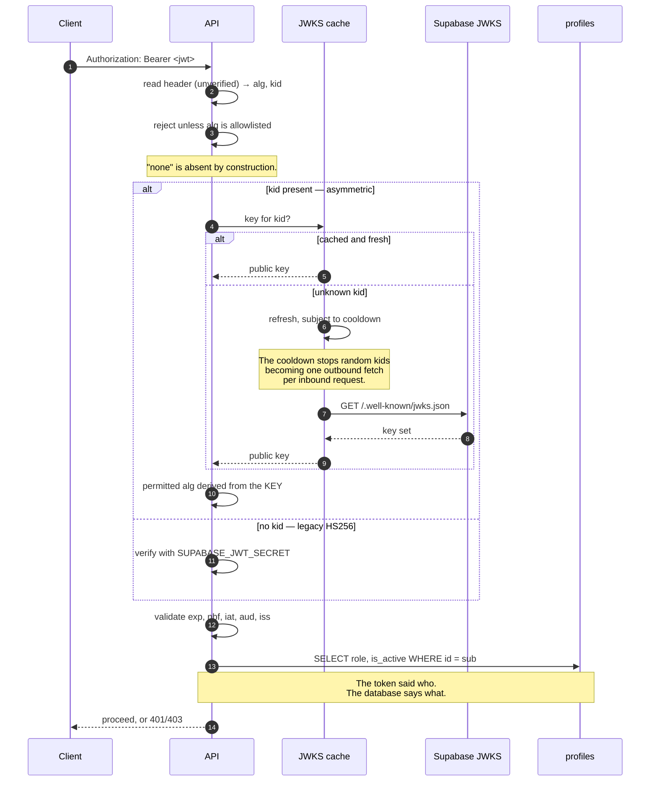
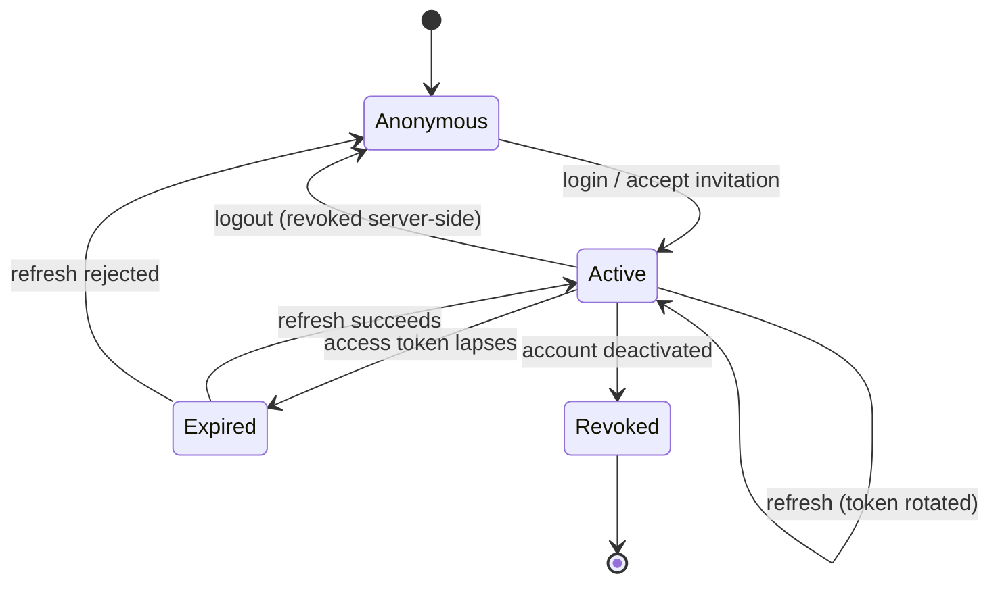

# Authentication

What happens on every authenticated request, and why it no longer touches the
network.

## Verification

## What changed and why

### No network call

The previous implementation called `supabase.auth.get_user(token)` on **every
request**. That added 100–300 ms to every endpoint and made Supabase Auth a hard
availability dependency — if it was slow, the whole API was.

Tokens are JWTs, so they can be verified from their signature locally.
`SUPABASE_JWT_SECRET` was already configured; it was simply never used.

### The role comes from the database

Previously the role travelled in the token, read from `user_metadata` — which is
populated from the sign-up request and is therefore attacker-controlled.

Now the token is trusted for exactly one claim: `sub`. Everything else is
resolved server-side, which means a role changed or revoked takes effect on the
caller's very next request rather than whenever their token happens to expire.

### Algorithm confusion

::: danger
Supporting both asymmetric and symmetric keys is where this gets dangerous. If
the permitted algorithm came from the token's own header, an attacker could take
a **public** RSA key from the published JWKS, use it as an **HMAC secret**, sign
a token with `alg: HS256`, and have it verify — because the server would happily
HMAC-verify against a key it believes is public.

The permitted algorithm is therefore derived from the key that was *selected*,
never from header input. The symmetric and asymmetric sets are disjoint, so a
key can never be used with an algorithm of the wrong family.
:::

## Sessions

Supabase rotates the refresh token on each use and invalidates the whole family
if a consumed token is replayed. That is what makes theft *detectable* rather
than silently persistent.

The frontend shares a single in-flight refresh across concurrent 401s — a burst
of expired requests firing a burst of refreshes would trip that reuse detection
and log the user out.

## Frontend

The cached user object in `localStorage` is a rendering convenience only. Its
role decides which dashboard renders, and the user can edit it freely in
devtools — so a cached session is revalidated against `GET /auth/me` before any
dashboard renders.

The server always re-checked on each API call, so this was a UI-shaping issue
rather than an authorization hole. It still meant an edited role changed what
was displayed.

::: warning Known gap
Tokens live in `localStorage`, so an XSS would expose them. Mitigated by a
strict CSP and React's default escaping. httpOnly cookies with CSRF
double-submit are the real fix.
:::

## Failure responses

| Condition | Status | Body |
| :--- | :--- | :--- |
| Missing or malformed token | 401 | `authentication_failed` |
| Expired | 401 | "Session expired. Please sign in again." |
| Signature invalid, bad `kid`, disallowed `alg` | 401 | "Invalid authentication token." |
| Account deactivated | 403 | "This account has been deactivated." |
| Role insufficient | 403 | "You do not have permission to perform this action." |
| Resource not owned | **404** | "The requested … was not found." |

The last row is deliberate. Returning 403 would confirm the record exists and
turn the endpoint into an id oracle. The response does not name the required
role either — that only helps map the permission model.
