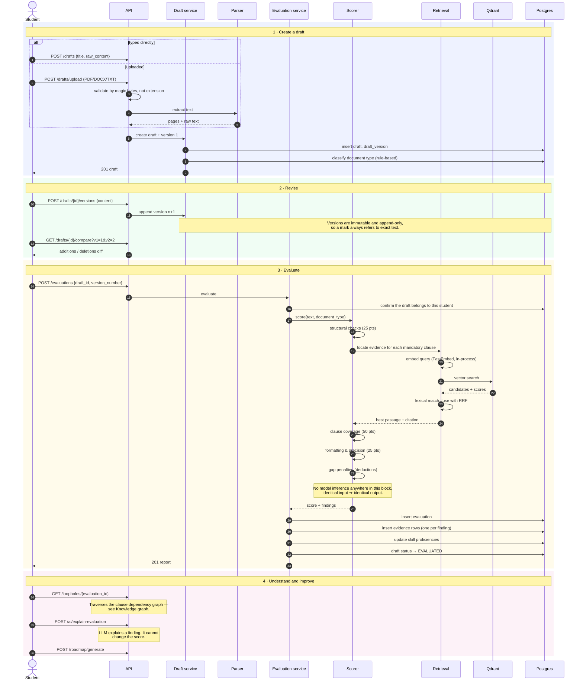

# Drafting & evaluation

The path from a student's text to a defensible mark. This is the flow the
product exists for, and the one where determinism matters most.

## End to end



## The rubric

100 points, fixed allocation:

| Band | Points | Assesses |
| :--- | ---: | :--- |
| Structural demarcation | 25 | Header, cause title, deponent block, verification jurat |
| Mandatory clause coverage | 50 | Statutory covenants required for the document type |
| Formatting & precision | 25 | Paragraph numbering, indentation, formal register |
| Gap penalties | deductions | Missing statutory warnings, omitted jurats |

Clause coverage carries half the marks because it is where statutory competence
actually shows. Structure and formatting are learnable in an afternoon; knowing
that a rent agreement needs an escalation clause is the skill being taught.

## Supported document types

| Type | Representative checks |
| :--- | :--- |
| `AFFIDAVIT_OF_CHARACTER` | Deponent oath, criminal non-conviction, verification jurat, stamp-duty warning |
| `EMPLOYMENT_AGREEMENT` | Appointment, remuneration, confidentiality, notice period, s.27 Contract Act restraint limits |
| `RENT_AGREEMENT` | Lessor/lessee demarcation, deposit, term, escalation, dispute resolution |
| `LEGAL_NOTICE` | Advocate cause title, transaction narrative, s.138 NI Act / s.80 CPC demand, 15-day cure period |

## Why determinism is enforced, not just claimed

"The scorer is deterministic" is only true if nothing in the path introduces
variance. Three things protect it:

**Rubrics are versioned data.** Loaded from YAML, and the version is recorded on
every evaluation. A rubric change does not silently alter historical marks —
the stored `rubric_version` says which rules produced them.

**Retrieval locates, it does not judge.** Vector search finds the candidate
passage. Whether that passage satisfies the criterion is decided by rules. A
retrieval drift changes *which evidence is cited*, not whether a clause passes.

**No LLM call exists in the scoring path.** Enforced by construction:
`app/ai/evaluation/` imports nothing from `app/ai/llm/`.

The score histogram on the [quality dashboard](/operations/observability) is the
check on all three. Because the scorer is deterministic, a shift in that
distribution means the rubric, the corpus or the cohort changed — never
run-to-run noise.

## Evidence

Every finding carries:

```json
{
  "category": "CLAUSE_COVERAGE",
  "criterion": "termination_notice_period",
  "status": "PARTIAL",
  "score": 6.0,
  "max_score": 10.0,
  "student_evidence": "Either party may end this agreement at will.",
  "reference_evidence": "Either party may terminate by providing thirty (30) days' written notice…",
  "source_document": "model_employment_agreement.pdf",
  "source_page": 4,
  "source_section": "Clause 8 — Termination",
  "explanation": "A termination clause is present but specifies no notice period."
}
```

`student_evidence` and `reference_evidence` sit side by side deliberately. A
student disputing a mark is shown their own words against the precedent, not a
number.

## Authorization

Reading an evaluation is permitted for the student who produced it, an admin,
or **a teacher on whose assignment it was submitted** — a teacher has no
standing claim on evaluations outside their own coursework.

Cross-tenant attempts return `404`, not `403`. A `403` confirms the record
exists and turns the endpoint into an id oracle.

::: warning Fixed in Phase 1
`GET /evaluations/{id}` and `GET /loopholes/{id}` previously matched on a bare
id with no ownership check, exposing any student's scores and verbatim draft
evidence to any authenticated caller. See the [security model](/security/model).
:::

## Related

- [Evaluation engine](/architecture/evaluation-engine) — internals of the scorer.
- [Retrieval](/architecture/retrieval) — how evidence is located.
- [Submissions](/flows/submissions) — attaching an evaluation to coursework.
