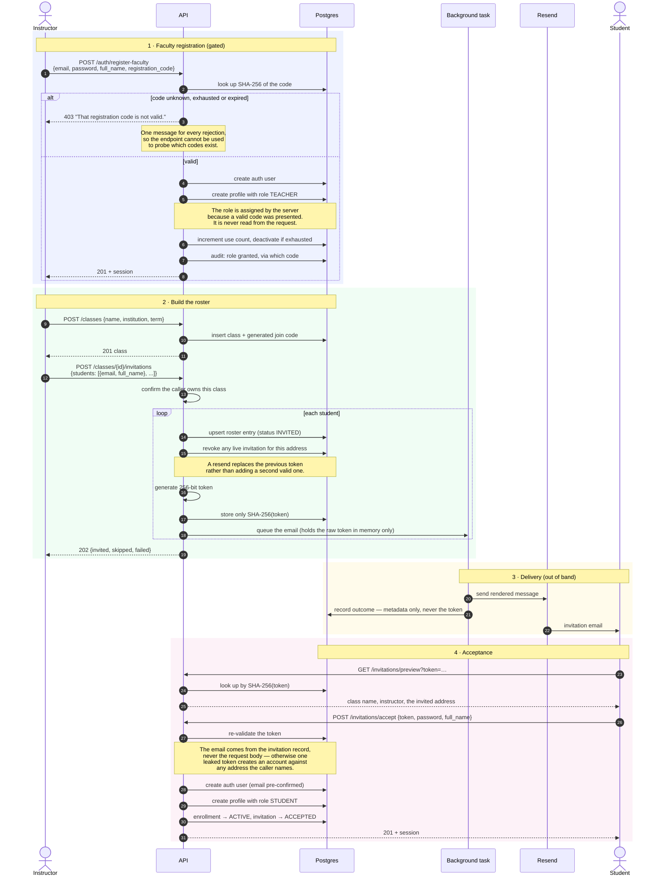
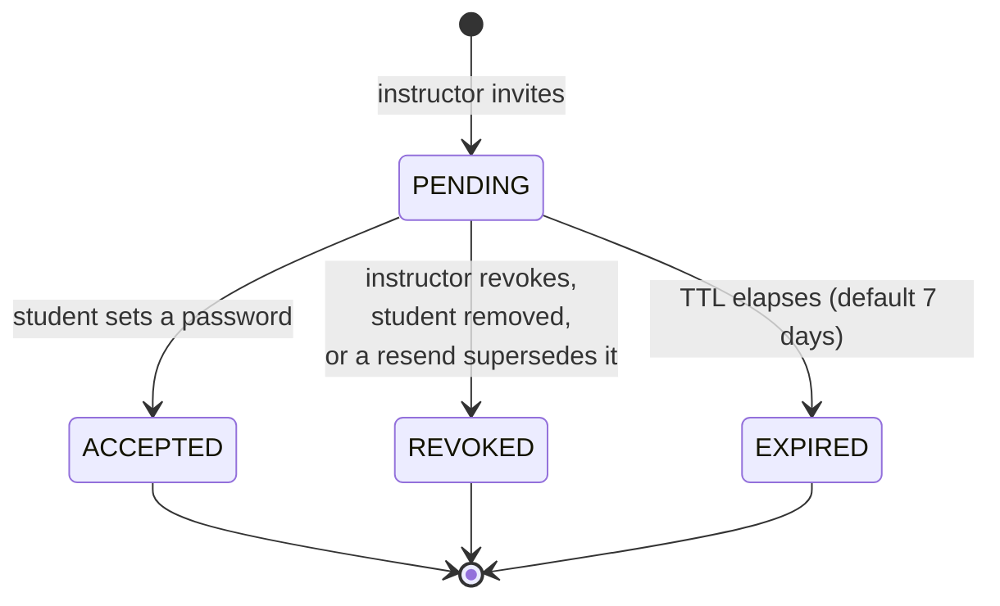

# Onboarding & invitations

This is the flow that replaced open self-registration. It is worth reading in
full before changing anything in it, because several steps exist to close
specific holes rather than to add features.

## Why it changed

The original system let anyone register and **choose their own role** from a
dropdown. Selecting "Faculty" granted reference-corpus upload, cohort analytics
across every student on the platform, and the ability to override any grade.

The fix has two halves. Removing `role` from the request is the obvious one.
The less obvious one: if faculty sign-up had simply stayed open, the hole would
reopen through the front door — the role would no longer come from the request
body, but anyone could still obtain one. So faculty registration is gated by an
institution-issued code, and students do not register at all.

## The flow

## Design decisions

### Only the token hash is stored

An invitation token is a bearer credential: holding one lets you create an
account bound to the invited address. It is treated like a password — the
database stores `SHA-256(token)` and the raw value exists only in the email.

A plain SHA-256 is correct here, unlike for passwords. The token carries 256
bits of entropy from `secrets`, so there is no dictionary to attack and no
reason to pay a slow KDF's cost on every acceptance lookup.

### The outbox stores no template context

The natural design queues the template plus its variables and lets a worker
render later. That cannot be used here: the context would contain the raw
token, which would then sit in a database row, in backups, and in anything that
reads the table — defeating the point of hashing it.

So invitations are rendered in-process and dispatched as a background task, and
the outbox records only delivery metadata. A permanently failed invitation is
therefore **not replayable**, which is the correct behaviour: the instructor
resends, and that mints a fresh token with a fresh expiry.

### Every bad token gives the same error

Unknown, expired, revoked and already-accepted all return:

> This invitation link is no longer valid. Ask your instructor to resend it.

Distinguishing them would let a caller probe which tokens exist. The specific
reason is logged.

### Re-adding a student revives their row

A removed student added back gets their existing enrollment reinstated rather
than a new one. Their drafts, evaluations and submissions stay attached.

### Removal is soft

Removing a student sets the enrollment to `REMOVED` and revokes pending
invitations. Their coursework is course record and is not deleted.

## Invitation states

A partial unique index enforces **at most one `PENDING` invitation per address
per class**, so resending cannot accumulate valid tokens.

## The join code

Each class carries a short human-readable code, for when an invitation email is
filtered or lost. It deliberately omits `0/O` and `1/I/L`, since codes get read
aloud and retyped.

It can be rotated (`POST /classes/{id}/rotate-join-code`), which is the remedy
when a code has been shared beyond the intended cohort.

## Related

- [Authentication](/flows/authentication) — what happens on every later request.
- [Security model](/security/model) — the trust boundaries this flow enforces.
- [Row-level security](/security/row-level-security) — database-layer backstop.
