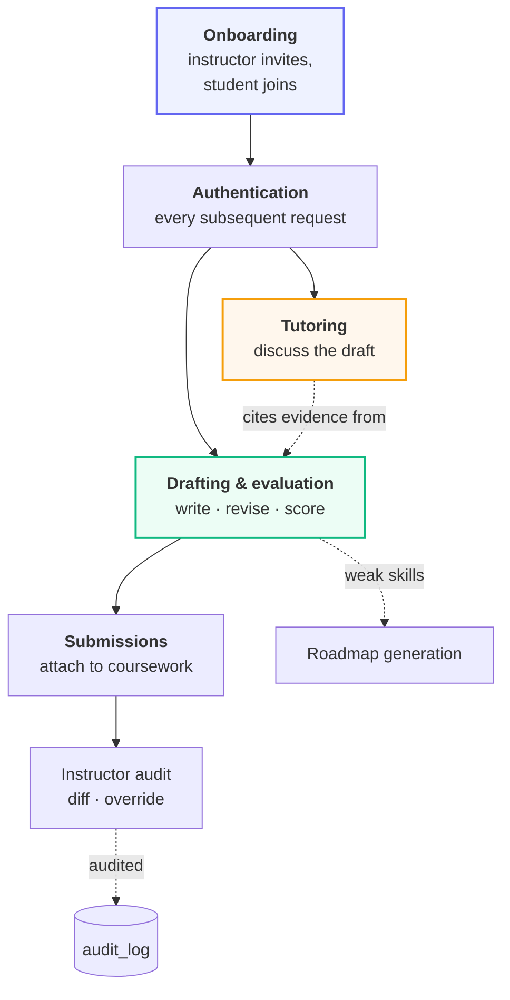

# End-to-end flows

Each page here follows one journey through the system, from the first HTTP
request to the last database write, with the reasoning behind each step.

## The journeys

| Flow | Starts with | Ends with |
| :--- | :--- | :--- |
| [Onboarding & invitations](/flows/onboarding) | An instructor pasting a roster | A student with an account and a class |
| [Authentication](/flows/authentication) | A bearer token | A resolved identity and role |
| [Drafting & evaluation](/flows/evaluation) | A student's text | A scored report with citations |
| [Coursework & submissions](/flows/submissions) | A published assignment | A graded, optionally overridden mark |
| [Socratic tutoring](/flows/tutoring) | A student's question | A guiding question, not an answer |

## How they connect

## The one invariant

The generative paths — tutoring, drafting assistance, evaluation explanation —
**can read a score but never write one**. Evaluation is reachable from tutoring
only as a source of context.

This is enforced structurally rather than by convention:
`app/ai/evaluation/` imports nothing from `app/ai/llm/`. A change that made the
scorer call a model would have to add that import, which is visible in review.

## A note on reading these

Each flow page marks steps that exist for **security** reasons rather than
functional ones, usually in a callout. Those steps often look removable — a
redundant lookup, an error that seems unhelpfully vague, a field taken from the
database when the request already carried it. They are not redundant; the
callout explains what breaks without them.
