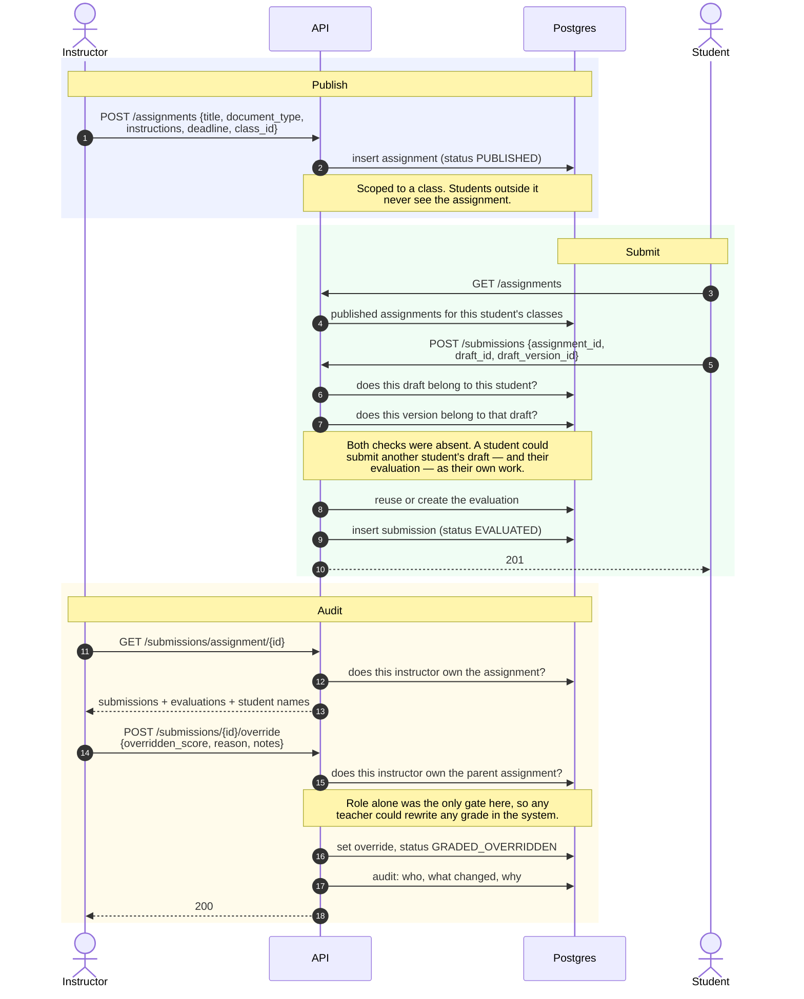
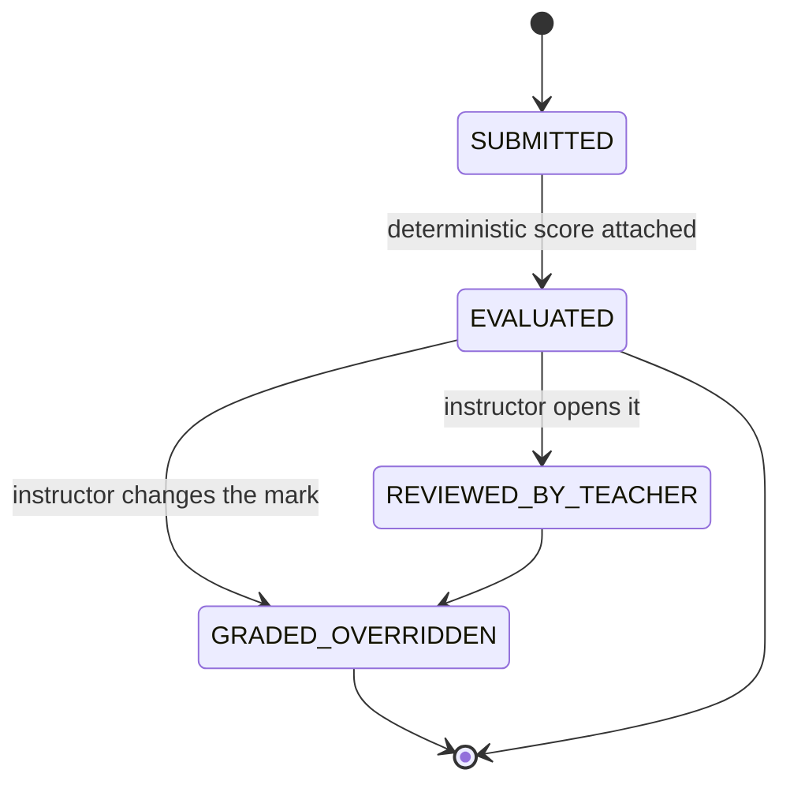

# Coursework & submissions

How an assignment goes from published to graded.

## Submission states

## Overrides

An override never deletes the machine score. The evaluation keeps
`overall_score` and gains `overridden_score`, `overridden_by` and
`override_reason`. Both marks remain visible, which matters when a student asks
why their score changed.

Every override is written to the audit log with the previous score, the new
score, the stated reason and the subject student. The log is append-only —
migration 005 grants no `UPDATE` or `DELETE` — so a compromised instructor
session cannot rewrite its own history.

## Authorization

| Action | Permitted to |
| :--- | :--- |
| Create an assignment | Instructor, for their own class |
| List published assignments | Students enrolled in that class |
| Submit | The student who owns the draft |
| List submissions | The instructor who owns the assignment |
| Override a score | The instructor who owns the parent assignment |

::: warning Three fixes in this flow
- Submitting accepted `draft_id` on trust — a student could submit another student's work.
- The version was not checked against the draft — an arbitrary version id could be attached to a legitimately owned draft.
- Overriding checked only that the caller was *a* teacher, not that they owned the assignment.
:::

## One submission per student per assignment

Enforced by a unique constraint on `(assignment_id, student_id)`. Resubmitting
means creating a new draft version and submitting that, which keeps the history
of what was actually marked.
