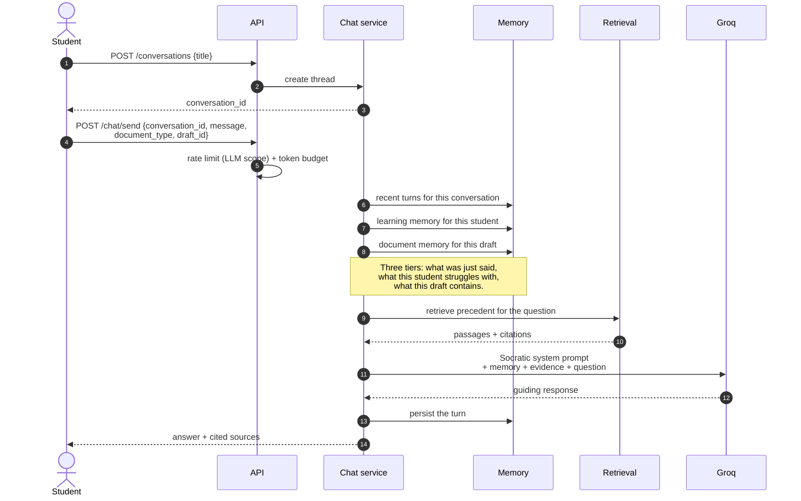

# Socratic tutoring

The generative side of the platform, and the one place where restraint is the
feature.

## The pedagogical constraint

Ask a general-purpose model "what should my termination clause say?" and it
writes the clause. The student pastes it in, scores well, and has learned
nothing — the cognitive work the exercise exists to produce has been done by the
model.

The tutor is prompted to answer that question with a question:

> Which statute governs notice periods for this kind of employment, and what
> minimum does it set? Look at what your clause currently says about *when*
> either party may end the agreement.

## The flow

## Memory tiers

| Tier | Holds | Why separate |
| :--- | :--- | :--- |
| Conversation | Recent turns | Immediate coherence |
| Learning | Recurring weak skills | Lets the tutor connect today's question to a pattern |
| Document | Summary of the draft under discussion | Avoids re-sending the whole draft on every turn |

Summarising the document rather than re-sending it keeps prompt tokens roughly
flat across a long conversation. Prompt-token growth is charted separately on
the [cost dashboard](/operations/observability) for exactly this reason.

## It cannot touch a score

The tutor, the drafting assistant and the evaluation explainer all read
evaluations for context and none can write one. Enforced structurally:
`app/ai/evaluation/` imports nothing from `app/ai/llm/`.

## Cost controls

Every generative endpoint carries:

- `LimitScope.LLM` — 10/min and 300/day per user by default.
- A per-user **daily token budget**, because request counts cannot bound spend.
- An outbound timeout, so a hung provider does not hold a worker.

Token counts are recorded per call, split into prompt and completion.

::: warning Known gap
Prompt-injection defences are not yet implemented. A student can place
instructions inside a draft that the tutor will read as part of its context.
The realistic impact is a student coaxing the tutor into writing their clause —
a pedagogical failure rather than a data breach, since the tutor has no
privileged access and cannot alter a mark. Delimiter isolation and instruction
hierarchy are the planned mitigations.
:::
