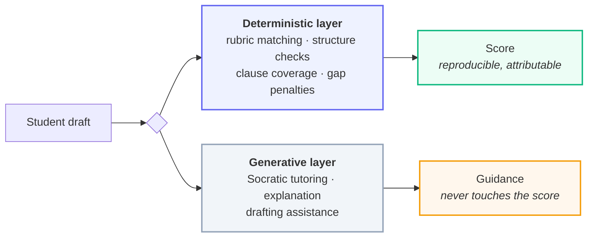

## What this documentation covers

| Section | Read it when |
| :--- | :--- |
| [Guide](/guide/introduction) | Running DraftForge locally, or configuring a deployment. |
| [Architecture](/architecture/overview) | Understanding how a subsystem works before changing it. |
| [Flows](/flows/overview) | Tracing a request end to end — onboarding, evaluation, submission. |
| [Security](/security/model) | Reviewing the trust boundaries, or changing anything touching authorization. |
| [Operations](/operations/observability) | Diagnosing production, or shipping a deploy. |
| [Reference](/reference/api) | Looking up an endpoint, a setting, or why a decision was made. |

## The core claim

Most LegalTech tools ask a language model to grade a document. That produces a
score that changes between runs, cannot be justified to a student who disputes
it, and is capable of confidently citing a statute that does not exist.

DraftForge splits the problem in two:

The generative layer never writes to a score. That separation is what makes the
mark defensible: a student disputing a result is shown the criterion, the
evidence and the rule that produced it.
