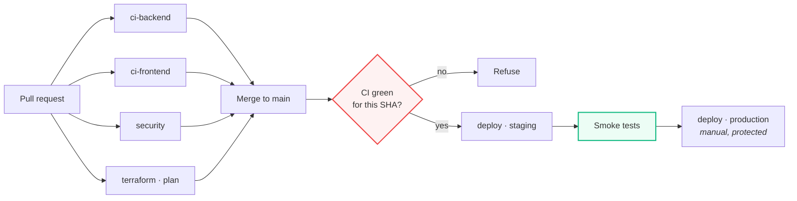
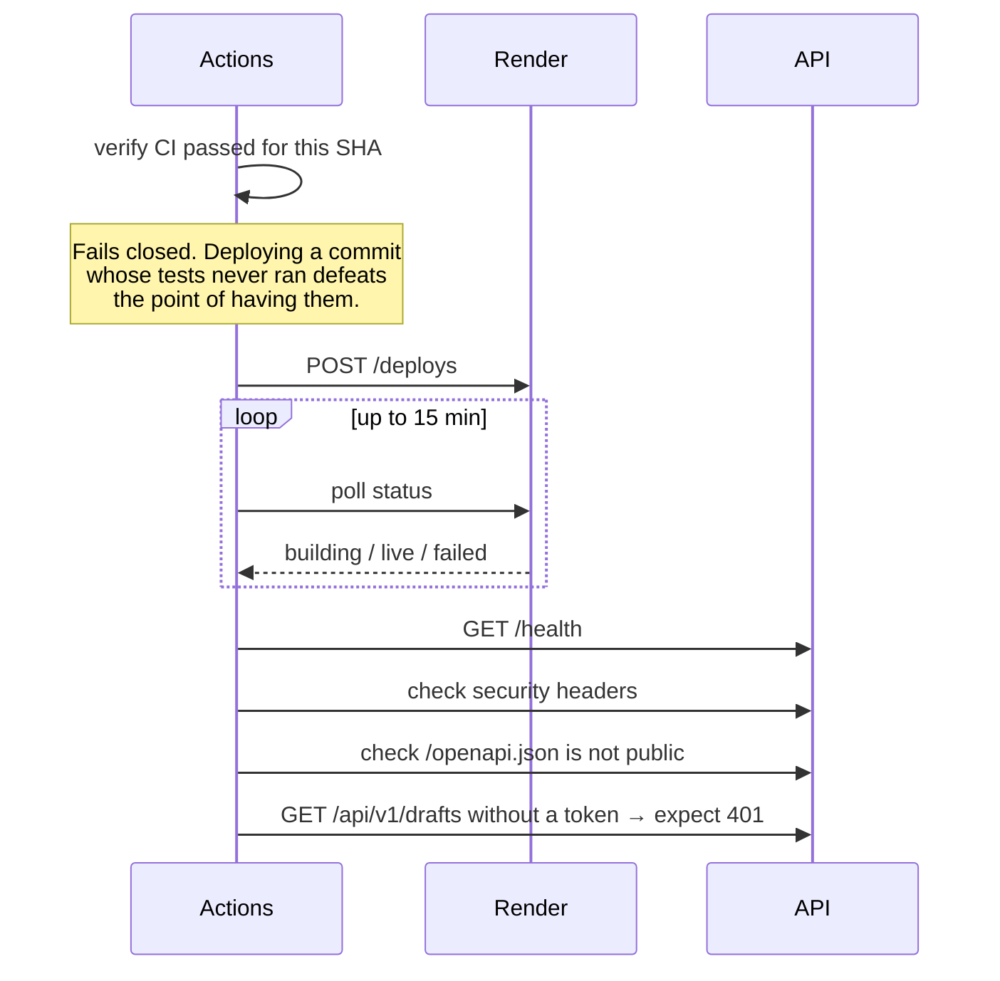

# CI/CD

Five workflows in `.github/workflows/`.



## ci-backend

| Job | Does |
| :--- | :--- |
| `lint` | ruff check, ruff format, mypy |
| `test` | pytest with coverage against a **real Redis** service container |
| `migrations` | Applies all migrations in order to Postgres, then asserts RLS coverage |

Redis is a service container rather than a mock so rate limiting is genuinely
exercised — with a fake, a regression in the limiter passes CI silently.

The migration job stubs the Supabase-specific objects (`auth.users`,
`auth.uid()`, the `authenticated` and `anon` roles) so the DDL runs on plain
Postgres. That catches ordering errors, typos and bad references. It does **not**
validate RLS behaviour, which needs a real Supabase project.

It then runs:

```sql
SELECT string_agg(tablename, ', ')
FROM pg_tables
WHERE schemaname = 'public' AND NOT rowsecurity;
```

Any result fails the build — guarding against a future migration repeating how
001–004 ended up with no RLS at all.

`mypy` is non-blocking. The inherited codebase is largely unannotated, so
failing on it would block every PR; `app/core`, `app/db` and `dependencies.py`
are strict via `pyproject` overrides.

## ci-frontend

Type check, build, bundle budget, and a grep of the build output for secrets.

That last check is not theatre: **Vite inlines every `VITE_`-prefixed variable
into the shipped bundle**. A service key named `VITE_SUPABASE_SERVICE_KEY`
becomes public the moment it deploys, and the failure is silent.

## security

| Job | Tool |
| :--- | :--- |
| `secrets` | gitleaks, **full history** |
| `python-sast` | bandit → SARIF, pip-audit |
| `node-audit` | npm audit, production dependencies only |
| `semgrep` | default, security-audit, OWASP Top Ten |
| `codeql` | Python and TypeScript, security-extended |
| `container` | Trivy, plus an assertion the image is not root |

Full history matters: a secret committed and later removed is still in the
history and still needs rotating.

`npm audit --omit=dev` is deliberate. A vulnerability in a build-time tool does
not ship to a browser, and treating the two alike produces noise that gets
ignored — which is worse than not scanning.

Runs nightly as well as on push, because advisories are published against
unchanged code.

## deploy



The smoke tests assert the Phase 1 controls are still in place after deploy. A
deploy that silently dropped the security headers should not count as
successful.

## terraform

`validate` runs fmt, validate, tflint and checkov on every PR — with
`-backend=false`, so it needs no credentials and works on forks.

`plan` posts the plan as a PR comment, truncated to fit GitHub's 65 536-character
comment limit.

`apply` is `workflow_dispatch` only, behind environment protection. Production
should require a reviewer: infrastructure changes are the least reversible thing
in the repository.

## Required secrets

| Secret | Used by |
| :--- | :--- |
| `RENDER_API_KEY` | deploy, terraform |
| `RENDER_{STAGING,PROD}_{BACKEND,FRONTEND}_SERVICE_ID` | deploy |
| `{STAGING,PROD}_API_URL` | deploy smoke tests |
| `TF_STATE_ACCESS_KEY_ID` / `TF_STATE_SECRET_ACCESS_KEY` | terraform |
| `GRAFANA_CLOUD_TOKEN`, `CLOUDFLARE_API_TOKEN` | terraform |

Service ids come from the Terraform outputs.

## Local parity

`.pre-commit-config.yaml` mirrors the CI checks:

```bash
pip install pre-commit && pre-commit install
```

Failures then surface before push rather than after.
