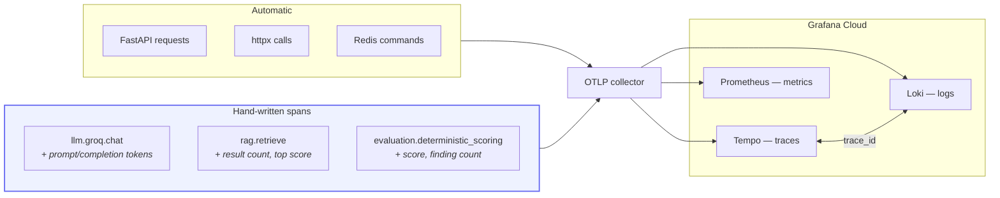

# Observability

## What is instrumented

Auto-instrumentation covers the boundaries — HTTP in, HTTP out, Redis. That is
not enough on its own: `POST /chat/send took 4.2s` tells you nothing you can act
on. The stages that actually consume time and money are instrumented by hand.



## Correlation

Every log line carries `request_id`, `trace_id` and `span_id`. Every response
carries `X-Request-ID`. That gives a single thread to pull:

```mermaid
flowchart LR
    U["User reports<br/>a failure"] --> RID["X-Request-ID<br/>from the response"]
    RID --> LOG["Loki:<br/>{request_id=\"…\"}"]
    LOG --> TR["Click trace_id"]
    TR --> SPAN["Tempo: the exact<br/>slow or failing span"]
    SPAN --> MET["Prometheus:<br/>is it systemic?"]

    style RID fill:#eef2ff,stroke:#6366f1
    style SPAN fill:#ecfdf5,stroke:#10b981
```

Loki's derived field turns the `trace_id` in a log line into a link to its
trace; Tempo's `tracesToLogsV2` goes the other way.

## Metrics

RED metrics for HTTP come from span metrics. These are the domain metrics that
cannot be inferred from request counts:

| Metric | Why it exists |
| :--- | :--- |
| `draftforge_llm_tokens_total` | Tokens map to money; requests do not. One long-context call can cost a hundred times another. |
| `draftforge_llm_duration` | Inference latency by model, separate from endpoint latency. |
| `draftforge_rag_top_score` | Best similarity per query. **The earliest signal that retrieval has regressed.** |
| `draftforge_rag_results` | Zero means the collection is empty, unreachable or over-filtered. |
| `draftforge_evaluation_score` | The scorer is deterministic, so a distribution shift means something real changed. |
| `draftforge_evaluation_duration` | Latency of the product's core claim. |
| `draftforge_auth_events_total` | A failure spike is credential stuffing; total request rate will not show it. |
| `draftforge_rate_limit_decisions_total` | Distinguishes an abusive client from limits set too tight. |
| `draftforge_emails_total` | A student cannot join without their invitation. |

## Dashboards

Version-controlled JSON in `observability/dashboards/`, provisioned identically
to the local stack and to Grafana Cloud, so the two cannot drift.

### API Health

RED metrics. The first thing to open when something is reported broken. Shows
p50 alongside p95 and p99 deliberately — a p95 that moves while p50 stays flat
points at a slow minority of requests, not a broad regression.

### LLM Cost & Performance

Token burn rate, estimated spend, and token share by operation. Prompt and
completion tokens are charted separately: prompt growth usually means context
bloat rather than more usage, and the two have different fixes.

Set the `price_per_million` variable to your provider's blended rate to turn
token counts into a cost estimate.

### Retrieval & Evaluation Quality

The dashboard that exists because **retrieval degrades silently** — nothing
errors, answers just get quietly worse. Median top-score and median result count
are the only early signals. Split by document type, because a regression usually
affects one rubric's corpus rather than all of them.

## Alerts

Deliberately few. Rules that fire on conditions nobody acts on train people to
ignore the channel.

| Alert | Fires when | Severity |
| :--- | :--- | :--- |
| `HighErrorRate` | >5% of requests failing for 5 min | critical |
| `LatencyRegression` | p95 above 5s for 10 min | warning |
| `LLMTokenBurnRateHigh` | >500k tokens/hour for 15 min | warning |
| `LLMErrorRateHigh` | >20% of inference calls failing | warning |
| `RetrievalScoreDegraded` | Median top score below 0.45 for 30 min | warning |
| `RetrievalReturningNothing` | p90 result count below 1 | critical |
| `AuthFailureSpike` | >5 auth failures/sec for 5 min | warning |
| `RateLimitSaturation` | >30% of requests limited | warning |
| `InvitationEmailsFailing` | >10% of invitations undelivered | critical |

`InvitationEmailsFailing` is critical rather than warning because it blocks
onboarding outright — a student with no invitation cannot join at all.

## Privacy

Two rules, enforced in two places:

**Query text is never a span attribute.** It is student-authored and frequently
quotes their draft. Only its length is recorded.

**Credentials are stripped twice.** The application keeps them out of
attributes; the collector additionally deletes `authorization`, `cookie`,
`set-cookie` and `db.statement`. One missed call site therefore cannot put a
secret in a trace backend.

Log redaction happens at the sink, not at call sites, for the same reason.

## Sampling

| Environment | Ratio | Rationale |
| :--- | ---: | :--- |
| Local | 1.0 | Volume is trivial; complete traces are worth more. |
| Staging | 1.0 | Same. |
| Production | 0.25 | Ample to characterise latency at a quarter of the cost. |

`ParentBased` sampling honours an upstream decision, so a sampled frontend trace
does not lose its backend half and appear broken.

## Running it locally

```bash
docker compose -f observability/docker-compose.observability.yml up -d
```

| Service | URL |
| :--- | :--- |
| Grafana | <http://localhost:3001> |
| Prometheus | <http://localhost:9090> |
| Tempo | <http://localhost:3200> |
| Loki | <http://localhost:3100> |
| OTLP | `http://localhost:4318` |

Then:

```bash
OTEL_ENABLED=True
OTEL_EXPORTER_OTLP_ENDPOINT=http://localhost:4318
LOG_FORMAT=json
```

Telemetry is entirely optional: every helper is a no-op when `OTEL_ENABLED` is
false, and instrumentation never raises. Instrumentation that can break a
request is worse than no instrumentation.
