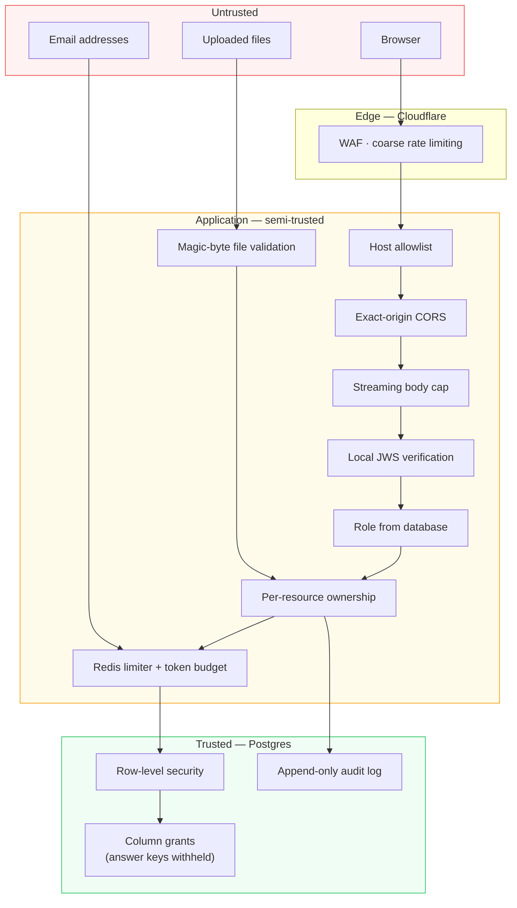

# Security model

## Governing principle

**The token establishes _who_ the caller is. The database decides _what_ they
may do.**

Everything below follows from that sentence. The original system violated it —
the role travelled in the token, and the client chose it — which is how a
dropdown on the sign-up form became a privilege-escalation vector.

## Trust boundaries



The application layer is **semi-trusted**: it enforces authorization, but the
database enforces it again. That redundancy is the point — a missing check in a
new endpoint is a bug, not a breach.

## Controls

### Authentication

Supabase-issued JWTs, verified **locally** against the project's JWKS (or the
shared secret for legacy HS256 projects), with full claim validation: `iss`,
`aud`, `exp`, `nbf`, `iat`, `sub`.

The previous implementation called `supabase.auth.get_user(token)` on every
request. That put a network round trip in front of every endpoint — 100–300 ms
— and made Supabase Auth a hard availability dependency. `SUPABASE_JWT_SECRET`
was configured but never used.

::: danger Algorithm confusion
Supporting both key families is the hazard. If permitted algorithms came from
the token's own header, an attacker could take a public RSA key from the JWKS,
sign a token with it as an **HMAC secret**, set `alg: HS256`, and have it
verify.

The permitted algorithm is therefore derived from **the key that was selected**,
never from header input. The symmetric and asymmetric sets are disjoint, and
`none` is absent by construction. Pinned by tests in
`tests/security/test_auth_hardening.py`.
:::

### Authorization

Three independent layers:

| Layer | Answers | Where |
| :--- | :--- | :--- |
| Role gate | May this *kind* of user call this endpoint? | `require_student` / `require_teacher` / `require_admin` |
| Ownership check | May *this* user touch *this* row? | `app/core/authorization.py` |
| Row-level security | Would the database permit it anyway? | Migration 005 |

The middle layer is the one that was missing. Role gates confirmed the caller
was *a* student or *a* teacher and then matched records on a caller-supplied id.

::: warning Four broken-access-control bugs, all fixed
- `GET /evaluations/{id}` returned any student's scores and draft evidence to any authenticated caller.
- `GET /loopholes/{id}` did the same, reaching through to draft contents.
- `POST /submissions/{id}/override` let **any** teacher rewrite the grade on **any** submission, including another instructor's cohort.
- `POST /submissions` accepted a `draft_id` on trust, so a student could submit another student's draft as their own.
- `PATCH /roadmap/items/{id}/complete` updated by bare id; `roadmap_items` has no user column, so ownership requires a join through `roadmaps`.
:::

Cross-tenant attempts return **404, not 403**. A 403 confirms the row exists.

### Roles are server-assigned

`role` is absent from every request schema, and the schemas use
`extra="forbid"` so a client still sending one **fails loudly** rather than
being silently ignored. `ADMIN` is never granted implicitly.

`ensure_profile` replaced `upsert_profile`, which rewrote every column on each
call — so an ordinary login could overwrite a stored role. Role changes go
through the audited `set_role`.

### Rate limiting and budgets

Redis sliding-window counters, evaluated atomically in Lua, with separate scopes:

| Scope | Default | Protects against |
| :--- | :--- | :--- |
| `AUTH` | 5/min, 30/hr | Credential stuffing, token guessing |
| `LLM` | 10/min, 300/day | Unbounded inference spend |
| `UPLOAD` | 40/hr | Storage and parsing abuse |
| `INVITE` | 200/hr | Mail-reputation damage |
| `DEFAULT` | 120/min | General abuse |

Plus a **per-user daily token budget**, because request counts cannot bound
spend — one long-context call may cost a hundred times another.

Keyed by user id where available, so an institution behind one NAT does not
share a bucket. Fails **closed** when `REDIS_REQUIRED`, which production forces
on along with `RATE_LIMIT_ENABLED`.

### CORS

::: danger The highest-severity baseline finding
```python
allow_origin_regex = r"^https?://(localhost|127\.0\.0\.1)(:\d+)?$|^https://.*\.onrender\.com$"
allow_credentials = True
```
Every `*.onrender.com` subdomain — a hostname anyone obtains by deploying
there — could make credentialed cross-origin requests and read the responses.
:::

Now an exact allowlist, validated at startup: `*` rejected, https required in
production, and localhost never injected in production.

### Uploads

Content type is decided by **inspecting the leading bytes**. The previous guard
read `if file.content_type and ...` — omitting the header skipped validation
entirely — and otherwise trusted a client-supplied extension.

- DOCX verified as genuine WordprocessingML, not merely a ZIP.
- Compression-ratio and uncompressed-size ceilings reject decompression bombs.
- PDFs rejected if encrypted or over 500 pages.
- Filenames sanitized before building any storage path: directory traversal, control characters and RTL-override disguises all stripped.
- The extension must agree with what the bytes actually are.

### Error handling

Uniform envelope, always:

```json
{ "code": "permission_denied", "detail": "…", "request_id": "a1b2c3…" }
```

Upstream text never reaches the client. Handlers previously echoed Supabase
errors, storage bucket paths, rubric filesystem paths, and — in the Groq
provider — the full upstream response body.

Secrets are redacted **at the logging sink**, not at call sites. Relying on
every call site to remember is a losing strategy.

### Audit trail

Privileged actions are recorded append-only: grade overrides, role grants,
reference uploads, invitations issued, revoked and accepted. Migration 005
grants no `UPDATE` or `DELETE`, so a compromised session cannot rewrite its own
history. Writes are best-effort — an audit failure never fails the action it
describes.

## Baseline findings

| # | Finding | Severity | Status |
| --: | :--- | :--- | :--- |
| 1 | Role self-assignment at registration | Critical | Fixed |
| 2 | Role escalation via `user_metadata` | Critical | Fixed |
| 3 | CORS trusting every `*.onrender.com` with credentials | Critical | Fixed |
| 4 | No RLS on 23 tables; service-role key everywhere | Critical | Migration 005 |
| 5 | Per-request Supabase auth round trip | Critical | Fixed |
| 6 | No rate limiting anywhere | Critical | Fixed |
| 7 | Bypassable file-type validation | High | Fixed |
| 8 | Upstream exception text leaked to clients | High | Fixed |
| 9 | No security headers; docs public in production | High | Fixed |
| 10 | Broken object-level authorization (×5) | High | Fixed |
| 11 | Answer keys readable by students | Medium | Column grants |
| 12 | Leaderboard and analytics unscoped across all students | Medium | Class-scoped |
| 13 | `/documents/classify` fully unauthenticated | Medium | Fixed |
| 14 | Unused `python-jose` and `passlib` | Medium | Removed |
| 15 | No audit trail on privileged actions | Medium | Added |
| 16 | Container ran as root | Medium | Non-root, CI-enforced |
| 17 | Demo credentials in the shipped bundle | Low | Removed |

## Known gaps

Stated plainly rather than omitted:

- **Repositories still use the service-role key**, which is `BYPASSRLS`. The
  policies in migration 005 defend against key leakage and direct database
  access today; making them the enforcement boundary for the API itself
  requires migrating repositories onto `get_user_scoped_client()`. That
  groundwork is in place.
- **Tokens live in `localStorage`**, so an XSS would expose them. Mitigated by a
  strict CSP and React's default escaping; httpOnly cookies are the real fix.
- **Prompt-injection defences on the tutor path are not yet implemented.** A
  student can put instructions in a draft that the tutor reads.
- **No automated dependency-update pipeline** beyond nightly advisory scanning.

## Reporting

Security issues should go to the maintainers privately rather than through a
public issue.
